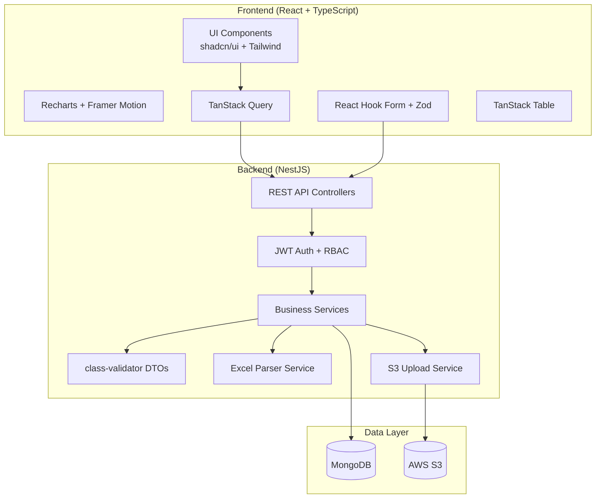

# Design Document: Alpha Star Aviation KPIs Dashboard

## Overview

The Alpha Star Aviation KPIs Dashboard is a full-stack web application designed to replace manual Excel-based reporting with a dynamic, accurate, and visually impressive system for tracking aircraft availability, utilization, maintenance activities, and costs. The system supports both manual data entry via web forms and bulk data import via Excel templates, with all data stored in MongoDB and file attachments in AWS S3.

The dashboard provides real-time KPI calculations including dynamic availability percentages (replacing static ~92% estimates), flight hours/cycles tracking, maintenance cost analysis, and accountability reporting for AOG events with responsibility attribution.

## Architecture



### Technology Stack

| Layer | Technology |
|-------|------------|
| Frontend | React 18, TypeScript, Vite, Tailwind CSS, shadcn/ui |
| Charts | Recharts, Framer Motion |
| Data Fetching | TanStack Query v5 |
| Tables | TanStack Table v8 |
| Forms | React Hook Form, Zod |
| Backend | NestJS, TypeScript |
| Database | MongoDB with Mongoose ODM |
| File Storage | AWS S3 (presigned URLs) |
| Authentication | JWT with role-based access |
| Excel Processing | xlsx library |
| API Documentation | Swagger/OpenAPI |

## Components and Interfaces

### Backend Modules

```mermaid
graph LR
    subgraph "NestJS Modules"
        AuthModule[Auth Module]
        AircraftModule[Aircraft Module]
        UtilizationModule[Utilization Module]
        StatusModule[Daily Status Module]
        AOGModule[AOG Events Module]
        MaintenanceModule[Maintenance Module]
        WorkOrderModule[Work Orders Module]
        DiscrepancyModule[Discrepancy Module]
        BudgetModule[Budget Module]
        ImportModule[Import Module]
        ExportModule[Export Module]
        S3Module[S3 Module]
    end
```



### API Endpoints

| Module | Endpoint | Method | Description |
|--------|----------|--------|-------------|
| Auth | `/auth/login` | POST | Authenticate user, return JWT |
| Auth | `/auth/register` | POST | Create new user (Admin only) |
| Aircraft | `/aircraft` | GET/POST | List/Create aircraft |
| Aircraft | `/aircraft/:id` | GET/PUT/DELETE | CRUD single aircraft |
| Utilization | `/utilization` | GET/POST | List/Create daily counters |
| Utilization | `/utilization/aggregations` | GET | Get aggregated utilization |
| Status | `/daily-status` | GET/POST | List/Create daily status |
| Status | `/daily-status/availability` | GET | Get availability metrics |
| AOG | `/aog-events` | GET/POST | List/Create AOG events |
| AOG | `/aog-events/analytics` | GET | Get AOG analytics by responsibility |
| Maintenance | `/maintenance-tasks` | GET/POST | List/Create tasks |
| Maintenance | `/maintenance-tasks/summary` | GET | Get maintenance summary |
| WorkOrders | `/work-orders` | GET/POST | List/Create work orders |
| Discrepancies | `/discrepancies` | GET/POST | List/Create discrepancies |
| Discrepancies | `/discrepancies/analytics` | GET | Get ATA chapter analytics |
| Budget | `/budget-plans` | GET/POST | List/Create budget plans |
| Budget | `/actual-spend` | GET/POST | List/Create actual spend |
| Budget | `/budget/analytics` | GET | Get budget vs actual |
| Import | `/import/template/:type` | GET | Download Excel template |
| Import | `/import/upload` | POST | Upload and parse Excel |
| Import | `/import/confirm` | POST | Confirm import of valid rows |
| Export | `/export/:type` | GET | Export data to Excel |
| Dashboard | `/dashboard/kpis` | GET | Get executive KPI summary |
| Dashboard | `/dashboard/trends` | GET | Get trend data |

### Frontend Pages

| Page | Route | Description |
|------|-------|-------------|
| Login | `/login` | Authentication page |
| Executive Dashboard | `/` | KPI cards, trends, overview |
| Fleet Availability | `/availability` | Availability by aircraft with filters |
| Aircraft Detail | `/aircraft/:id` | Single aircraft deep dive |
| Maintenance Operations | `/maintenance` | Shift-based task logging |
| AOG & Events | `/events` | AOG tracking with attribution |
| Work Orders | `/work-orders` | WO management and status |
| Discrepancies | `/discrepancies` | Defect tracking by ATA |
| Budget & Cost | `/budget` | Plan vs actual, burn rate |
| Data Import | `/import` | Excel upload workflow |
| Admin Settings | `/admin` | User management, rates |

## Data Models

### MongoDB Collections

```typescript
// Aircraft Master
interface Aircraft {
  _id: ObjectId;
  registration: string;        // Unique, e.g., "HZ-A42"
  fleetGroup: string;          // e.g., "A330", "G650ER"
  aircraftType: string;        // e.g., "A340-642"
  msn: string;                 // Manufacturer Serial Number
  owner: string;
  manufactureDate: Date;
  enginesCount: number;        // 2 or 4
  status: 'active' | 'parked' | 'leased';
  createdAt: Date;
  updatedAt: Date;
}

// Daily Utilization Counters
interface DailyCounter {
  _id: ObjectId;
  aircraftId: ObjectId;
  date: Date;
  airframeHoursTtsn: number;
  airframeCyclesTcsn: number;
  engine1Hours: number;
  engine1Cycles: number;
  engine2Hours: number;
  engine2Cycles: number;
  engine3Hours?: number;
  engine3Cycles?: number;
  engine4Hours?: number;
  engine4Cycles?: number;
  apuHours: number;
  apuCycles?: number;
  lastFlightDate?: Date;
  updatedBy: ObjectId;
  createdAt: Date;
}

// Daily Status (Availability)
interface DailyStatus {
  _id: ObjectId;
  aircraftId: ObjectId;
  date: Date;
  posHours: number;            // Baseline (typically 24)
  fmcHours: number;            // Fully Mission Capable
  nmcmSHours: number;          // Scheduled downtime
  nmcmUHours: number;          // Unscheduled downtime
  nmcsHours?: number;          // Supply downtime
  notes?: string;
  updatedBy: ObjectId;
  createdAt: Date;
}

// AOG Events
interface AOGEvent {
  _id: ObjectId;
  aircraftId: ObjectId;
  detectedAt: Date;
  clearedAt?: Date;
  category: 'scheduled' | 'unscheduled' | 'aog';
  reasonCode: string;
  responsibleParty: 'Internal' | 'OEM' | 'Customs' | 'Finance' | 'Other';
  actionTaken: string;
  manpowerCount: number;
  manHours: number;
  costLabor?: number;
  costParts?: number;
  costExternal?: number;
  attachments: string[];       // S3 keys
  updatedBy: ObjectId;
  createdAt: Date;
}

// Maintenance Tasks
interface MaintenanceTask {
  _id: ObjectId;
  aircraftId: ObjectId;
  date: Date;
  shift: 'Morning' | 'Evening' | 'Night' | 'Other';
  taskType: string;
  taskDescription: string;
  manpowerCount: number;
  manHours: number;
  cost?: number;
  workOrderRef?: ObjectId;
  updatedBy: ObjectId;
  createdAt: Date;
}

// Work Orders
interface WorkOrder {
  _id: ObjectId;
  woNumber: string;            // Unique
  aircraftId: ObjectId;
  description: string;
  status: 'Open' | 'InProgress' | 'Closed' | 'Deferred';
  dateIn: Date;
  dateOut?: Date;
  dueDate?: Date;
  crsNumber?: string;
  mrNumber?: string;
  updatedBy: ObjectId;
  createdAt: Date;
}

// Discrepancies
interface Discrepancy {
  _id: ObjectId;
  aircraftId: ObjectId;
  dateDetected: Date;
  ataChapter: string;
  discrepancyText: string;
  dateCorrected?: Date;
  correctiveAction?: string;
  responsibility?: 'Internal' | 'OEM' | 'Customs' | 'Finance' | 'Other';
  downtimeHours?: number;
  updatedBy: ObjectId;
  createdAt: Date;
}

// Budget Plan
interface BudgetPlan {
  _id: ObjectId;
  fiscalYear: number;
  clauseId: number;
  clauseDescription: string;
  aircraftGroup: string;
  plannedAmount: number;
  currency: string;
  createdAt: Date;
}

// Actual Spend
interface ActualSpend {
  _id: ObjectId;
  period: string;              // YYYY-MM
  aircraftGroup?: string;
  aircraftId?: ObjectId;
  clauseId: number;
  amount: number;
  currency: string;
  vendor?: string;
  notes?: string;
  updatedBy: ObjectId;
  createdAt: Date;
}

// Import Log
interface ImportLog {
  _id: ObjectId;
  filename: string;
  s3Key: string;
  importType: string;
  rowCount: number;
  successCount: number;
  errorCount: number;
  errors: { row: number; message: string }[];
  importedBy: ObjectId;
  createdAt: Date;
}

// User
interface User {
  _id: ObjectId;
  email: string;               // Unique
  passwordHash: string;
  name: string;
  role: 'Admin' | 'Editor' | 'Viewer';
  createdAt: Date;
  updatedAt: Date;
}
```

### Indexes

```javascript
// Aircraft
db.aircraft.createIndex({ registration: 1 }, { unique: true });
db.aircraft.createIndex({ fleetGroup: 1, status: 1 });

// Daily Counters
db.dailyCounters.createIndex({ aircraftId: 1, date: -1 });
db.dailyCounters.createIndex({ date: -1 });

// Daily Status
db.dailyStatus.createIndex({ aircraftId: 1, date: -1 });
db.dailyStatus.createIndex({ date: -1 });

// AOG Events
db.aogEvents.createIndex({ aircraftId: 1, detectedAt: -1 });
db.aogEvents.createIndex({ responsibleParty: 1, detectedAt: -1 });

// Maintenance Tasks
db.maintenanceTasks.createIndex({ aircraftId: 1, date: -1 });
db.maintenanceTasks.createIndex({ date: -1, shift: 1 });

// Work Orders
db.workOrders.createIndex({ woNumber: 1 }, { unique: true });
db.workOrders.createIndex({ aircraftId: 1, status: 1 });
db.workOrders.createIndex({ dueDate: 1, status: 1 });

// Discrepancies
db.discrepancies.createIndex({ aircraftId: 1, dateDetected: -1 });
db.discrepancies.createIndex({ ataChapter: 1 });

// Budget
db.budgetPlans.createIndex({ fiscalYear: 1, clauseId: 1, aircraftGroup: 1 });
db.actualSpend.createIndex({ period: 1, clauseId: 1 });

// Users
db.users.createIndex({ email: 1 }, { unique: true });
```

## Correctness Properties

*A property is a characteristic or behavior that should hold true across all valid executions of a system-essentially, a formal statement about what the system should do. Properties serve as the bridge between human-readable specifications and machine-verifiable correctness guarantees.*

Based on the prework analysis, the following correctness properties have been identified:

### Property 1: Aircraft Registration Uniqueness
*For any* two aircraft creation attempts with the same registration value, the second attempt should be rejected with a validation error, and only one aircraft record should exist in the database.
**Validates: Requirements 1.2**

### Property 2: Monotonic Counter Validation
*For any* daily counter submission where any counter value (airframe hours, cycles, engine hours, etc.) is less than the previous day's value for the same aircraft, the submission should be rejected with a monotonic validation error.
**Validates: Requirements 2.2**

### Property 3: Daily Flight Hours Delta Calculation
*For any* two consecutive daily counter records for the same aircraft, the computed daily flight hours should equal (today's airframe_hours_ttsn - yesterday's airframe_hours_ttsn).
**Validates: Requirements 2.3**

### Property 4: Availability Percentage Calculation
*For any* date range and aircraft, the computed availability percentage should equal (sum of fmc_hours / sum of pos_hours) * 100 for all daily status records in that range.
**Validates: Requirements 3.2, 3.5**

### Property 5: AOG Timestamp Validation
*For any* AOG event where cleared_at is provided, if cleared_at is earlier than detected_at, the submission should be rejected with a timestamp validation error.
**Validates: Requirements 4.6**

### Property 6: AOG Downtime Duration Calculation
*For any* AOG event with both detected_at and cleared_at timestamps, the computed downtime duration should equal (cleared_at - detected_at) in hours.
**Validates: Requirements 4.3**

### Property 7: Responsible Party Enum Validation
*For any* AOG event creation, the responsible_party field should only accept values from the set {Internal, OEM, Customs, Finance, Other}, and any other value should be rejected.
**Validates: Requirements 4.2**

### Property 8: AOG Downtime Grouping by Responsibility
*For any* set of AOG events, the total downtime hours grouped by responsible_party should equal the sum of individual event durations for each responsibility category.
**Validates: Requirements 4.4**

### Property 9: Work Order Turnaround Calculation
*For any* closed work order with both date_in and date_out, the computed turnaround time should equal (date_out - date_in) in days.
**Validates: Requirements 6.2**

### Property 10: Overdue Work Order Detection
*For any* work order where due_date is in the past and status is not 'Closed', the work order should be flagged as overdue.
**Validates: Requirements 6.6**

### Property 11: Budget Variance Calculation
*For any* budget clause and period, the computed variance should equal (planned_amount - sum of actual_amounts) for that clause and period.
**Validates: Requirements 7.3**

### Property 12: Cost Per Flight Hour Calculation
*For any* period with both cost data and utilization data, cost_per_flight_hour should equal (total_cost / total_flight_hours) for that period.
**Validates: Requirements 7.6**

### Property 13: Excel Import Round-Trip
*For any* valid data set, exporting to Excel template format and then importing the same file should result in equivalent data being stored in the database.
**Validates: Requirements 2.4, 5.4, 10.2, 10.3, 10.4**

### Property 14: Role-Based Access Control
*For any* user with Viewer role attempting a write operation, the operation should be rejected with an authorization error. *For any* user with Editor role attempting a write operation on operational data, the operation should succeed. *For any* user with Admin role, all operations should succeed.
**Validates: Requirements 9.3, 9.4, 9.5**

### Property 15: Maintenance Summary Aggregation
*For any* set of maintenance tasks, the summary totals (task count, man-hours, cost) grouped by any dimension (date, shift, aircraft, task_type) should equal the sum of individual task values for that grouping.
**Validates: Requirements 5.2**

### Property 16: Discrepancy ATA Chapter Grouping
*For any* set of discrepancies, the count grouped by ata_chapter should equal the number of discrepancies with that ATA chapter value.
**Validates: Requirements 6.4**

### Property 17: Dashboard KPI Consistency
*For any* date range, the executive dashboard KPI values (fleet availability, total flight hours, total cycles, active AOG count) should match the aggregated values computed from the underlying data collections.
**Validates: Requirements 8.1, 8.4**

## Error Handling

### Validation Errors
- All DTOs use class-validator decorators for input validation
- Validation errors return 400 Bad Request with detailed field-level messages
- Frontend displays inline validation errors using Zod schemas

### Business Rule Errors
- Monotonic counter violations return 422 Unprocessable Entity
- Timestamp validation errors return 422 Unprocessable Entity
- Duplicate key errors return 409 Conflict

### Authentication/Authorization Errors
- Invalid credentials return 401 Unauthorized
- Missing/expired JWT returns 401 Unauthorized
- Insufficient permissions return 403 Forbidden

### Excel Import Errors
- Invalid file format returns 400 Bad Request
- Row-level validation errors are collected and returned in response
- Partial imports are supported (valid rows imported, invalid rows reported)

### S3 Errors
- Upload failures return 500 Internal Server Error with retry guidance
- Presigned URL generation failures are logged and reported

## Testing Strategy

### Dual Testing Approach

The system employs both unit tests and property-based tests for comprehensive coverage:

**Unit Tests** verify specific examples and edge cases:
- API endpoint behavior with valid/invalid inputs
- Service method logic with known inputs
- DTO validation with boundary values
- Authentication flow with various credentials

**Property-Based Tests** verify universal properties across all inputs:
- Use **fast-check** library for TypeScript property-based testing
- Each property test runs minimum 100 iterations
- Tests are tagged with property references: `**Feature: alphastar-kpi-dashboard, Property N: description**`

### Test Categories

| Category | Framework | Focus |
|----------|-----------|-------|
| Unit Tests | Jest | Individual functions, edge cases |
| Property Tests | fast-check | Universal properties, random inputs |
| Integration Tests | Jest + Supertest | API endpoints, database operations |
| E2E Tests | Playwright (optional) | Critical user flows |

### Property Test Implementation

Each correctness property from the design document is implemented as a single property-based test:

```typescript
// Example: Property 2 - Monotonic Counter Validation
describe('DailyCounter Service', () => {
  it('**Feature: alphastar-kpi-dashboard, Property 2: Monotonic Counter Validation**', () => {
    fc.assert(
      fc.property(
        fc.record({
          previousHours: fc.float({ min: 0, max: 100000 }),
          currentHours: fc.float({ min: 0, max: 100000 }),
        }),
        ({ previousHours, currentHours }) => {
          // If current < previous, validation should fail
          if (currentHours < previousHours) {
            expect(() => validateMonotonicCounter(previousHours, currentHours))
              .toThrow('Monotonic validation error');
          }
        }
      ),
      { numRuns: 100 }
    );
  });
});
```

### Test File Organization

```
backend/
├── src/
│   ├── aircraft/
│   │   ├── aircraft.service.ts
│   │   ├── aircraft.service.spec.ts      # Unit tests
│   │   └── aircraft.property.spec.ts     # Property tests
│   ├── utilization/
│   │   ├── utilization.service.ts
│   │   ├── utilization.service.spec.ts
│   │   └── utilization.property.spec.ts
│   └── ...
└── test/
    └── e2e/
        └── app.e2e-spec.ts
```

