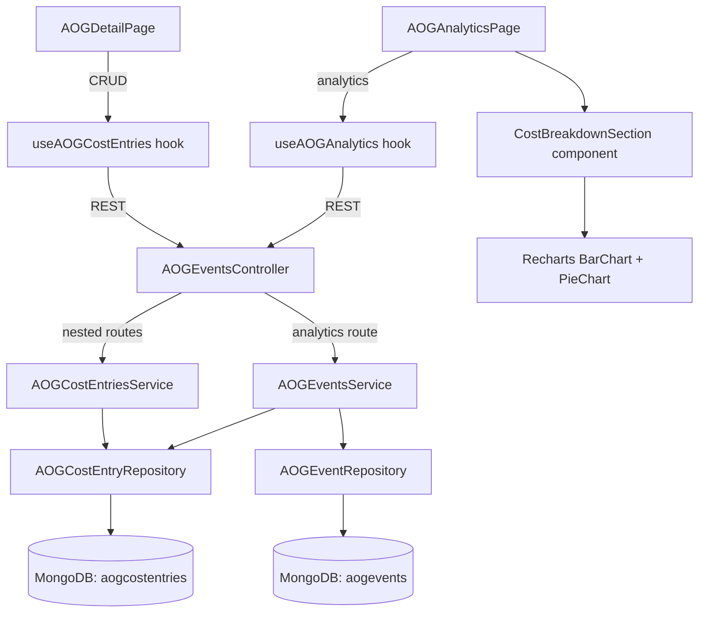

# Design Document: AOG Cost Breakdown

## Overview

This feature adds a granular, per-department cost tracking system to AOG events. Each AOG event can have multiple **Cost Entry** records, each capturing a department, internal cost, external cost, and an optional note. The feature spans the full stack: a new Mongoose collection, nested CRUD API endpoints, a multi-step form dialog on the AOG Detail page, cost entry cards with summary totals, aggregated cost analytics (bar + pie charts) on the AOG Analytics page with filter support, and PDF export of the new analytics section.

The design mirrors the existing **AOG Sub-Event** pattern (separate collection, repository, service, controller routes nested under the parent event) to keep the implementation consistent and fast.

## Architecture

The cost breakdown feature follows the established module-based architecture:



Key architectural decisions:

1. **Separate collection** (`aogcostentries`) rather than embedded sub-documents — keeps the parent AOG event document lean and allows independent aggregation pipelines for analytics.
2. **Reuse existing controller** — cost entry routes are added to `AOGEventsController` as nested routes under `/:parentId/cost-entries`, matching the sub-event pattern.
3. **Analytics aggregation** — the cost breakdown analytics endpoint joins `aogcostentries` with `aogevents` (and `aircrafts` for fleet group filtering) using MongoDB aggregation pipelines, avoiding N+1 queries.
4. **PDF export** — the new Cost Breakdown section on the analytics page uses the same `html2canvas` capture approach as existing chart sections, requiring only that the section is rendered in the DOM before export.

## Components and Interfaces

### Backend Components

#### 1. AOGCostEntry Schema (`schemas/aog-cost-entry.schema.ts`)

New Mongoose schema defining the cost entry document.

#### 2. AOGCostEntryRepository (`repositories/aog-cost-entry.repository.ts`)

Repository class following the same pattern as `AOGSubEventRepository`:
- `create(data)` — insert a new cost entry
- `findById(id)` — find by document ID
- `findByParentId(parentId)` — find all entries for a parent event, sorted by `createdAt` descending
- `update(id, data)` — update a cost entry
- `delete(id)` — delete a cost entry
- `deleteByParentId(parentId)` — cascade delete when parent event is deleted
- `aggregate(pipeline)` — run aggregation pipelines for analytics

#### 3. AOGCostEntriesService (`services/aog-cost-entries.service.ts`)

Service class handling business logic:
- Validates parent event existence before create/update
- Validates cost entry existence before update/delete
- Delegates to repository for persistence

#### 4. Cost Breakdown Analytics (in `AOGEventsService`)

New method `getCostBreakdown(filter)` added to the existing `AOGEventsService`:
- Builds a MongoDB aggregation pipeline that:
  1. Matches parent AOG events by filter criteria (aircraftId, fleetGroup, category, date range)
  2. Looks up cost entries via `$lookup` from `aogcostentries`
  3. Unwinds and groups by department
  4. Computes totals per department and grand totals

#### 5. DTOs

- `CreateCostEntryDto` — department (required, enum), internalCost (required, >= 0), externalCost (required, >= 0), note (optional)
- `UpdateCostEntryDto` — all fields optional (partial update)

#### 6. Controller Routes (added to `AOGEventsController`)

| Method | Route | Auth | Description |
|--------|-------|------|-------------|
| POST | `/:parentId/cost-entries` | Admin, Editor | Create cost entry |
| GET | `/:parentId/cost-entries` | Authenticated | List cost entries for event |
| PUT | `/:parentId/cost-entries/:entryId` | Admin, Editor | Update cost entry |
| DELETE | `/:parentId/cost-entries/:entryId` | Admin, Editor | Delete cost entry |
| GET | `/analytics/cost-breakdown` | Authenticated | Aggregated cost analytics |

### Frontend Components

#### 1. `useAOGCostEntries` Hook (`hooks/useAOGCostEntries.ts`)

TanStack Query hooks following the `useAOGSubEvents` pattern:
- `useCostEntries(parentId)` — query all cost entries for an event
- `useCreateCostEntry()` — mutation to create
- `useUpdateCostEntry()` — mutation to update
- `useDeleteCostEntry()` — mutation to delete
- Query key: `['cost-entries', parentId]`
- Invalidates `['cost-entries', parentId]` and `['aog-analytics']` on mutations

#### 2. `useAOGCostBreakdown` Hook (added to `hooks/useAOGAnalytics.ts`)

New analytics query hook:
- `useAOGCostBreakdown(filter)` — fetches `/aog-events/analytics/cost-breakdown`
- Query key: `['aog-analytics', 'cost-breakdown', filter]`

#### 3. `CostEntryFormDialog` Component (`components/aog/CostEntryFormDialog.tsx`)

Multi-step dialog following the `SubEventFormDialog` pattern:
- Step 1: Department selection (6 radio/button options)
- Step 2: Internal Cost (USD), External Cost (USD), Note (optional textarea)
- Supports create and edit modes
- Uses Zod schema for validation (non-negative numbers)
- Shows success/error toast on submit

#### 4. `CostBreakdownCards` Component (`components/aog/CostBreakdownCards.tsx`)

Displayed on AOG Detail page:
- Renders each cost entry as a card (department badge, internal cost, external cost, total, note)
- Summary row at top: total internal, total external, grand total
- Edit/delete actions for Admin/Editor roles
- Empty state when no entries exist

#### 5. `CostBreakdownSection` Component (inline in `AOGAnalyticsPage.tsx`)

Analytics section following the `CategoryBreakdownSection` pattern:
- Summary cards: Total Internal Cost, Total External Cost
- Bar chart: internal vs external cost per department (grouped bars)
- Pie chart: total cost distribution by department (donut chart)
- Respects filter bar parameters
- Empty state when no data

### Interface Contracts

#### Cost Entry Response
```typescript
interface CostEntryResponse {
  _id: string;
  parentEventId: string;
  department: 'QC' | 'Engineering' | 'Project Management' | 'Procurement' | 'Technical' | 'Others';
  internalCost: number;
  externalCost: number;
  note: string | null;
  updatedBy: string;
  createdAt: string;
  updatedAt: string;
}
```

#### Cost Breakdown Analytics Response
```typescript
interface CostBreakdownResponse {
  departments: {
    department: string;
    internalCost: number;
    externalCost: number;
    totalCost: number;
    entryCount: number;
  }[];
  totals: {
    internalCost: number;
    externalCost: number;
    totalCost: number;
  };
}
```

## Data Models

### AOGCostEntry Collection (`aogcostentries`)

| Field | Type | Required | Default | Description |
|-------|------|----------|---------|-------------|
| parentEventId | ObjectId (ref: AOGEvent) | Yes | — | Reference to parent AOG event |
| department | String (enum) | Yes | — | QC, Engineering, Project Management, Procurement, Technical, Others |
| internalCost | Number | Yes | — | Internal cost in USD, >= 0 |
| externalCost | Number | Yes | — | External cost in USD, >= 0 |
| note | String | No | — | Optional note |
| updatedBy | ObjectId (ref: User) | Yes | — | Audit trail |
| createdAt | Date | Auto | — | Mongoose timestamp |
| updatedAt | Date | Auto | — | Mongoose timestamp |

**Indexes:**
- `{ parentEventId: 1, createdAt: -1 }` — primary query pattern (list entries for an event)
- `{ parentEventId: 1 }` — cascade delete

**Validation Rules:**
- `department` must be one of the 6 enum values
- `internalCost` >= 0
- `externalCost` >= 0
- `parentEventId` must reference an existing AOG event

### Aggregation Pipeline (Cost Breakdown Analytics)

```javascript
[
  // 1. Match parent AOG events by filters
  { $match: { /* aircraftId, category, detectedAt range */ } },
  
  // 2. Lookup aircraft for fleetGroup filtering
  { $lookup: { from: 'aircrafts', localField: 'aircraftId', foreignField: '_id', as: 'aircraft' } },
  { $unwind: '$aircraft' },
  // Optional: { $match: { 'aircraft.fleetGroup': fleetGroup } },
  
  // 3. Lookup cost entries
  { $lookup: { from: 'aogcostentries', localField: '_id', foreignField: 'parentEventId', as: 'costEntries' } },
  { $unwind: '$costEntries' },
  
  // 4. Group by department
  { $group: {
      _id: '$costEntries.department',
      internalCost: { $sum: '$costEntries.internalCost' },
      externalCost: { $sum: '$costEntries.externalCost' },
      totalCost: { $sum: { $add: ['$costEntries.internalCost', '$costEntries.externalCost'] } },
      entryCount: { $sum: 1 }
  }},
  
  // 5. Sort by totalCost descending
  { $sort: { totalCost: -1 } }
]
```

Grand totals are computed in the service layer by summing across departments.


## Correctness Properties

*A property is a characteristic or behavior that should hold true across all valid executions of a system — essentially, a formal statement about what the system should do. Properties serve as the bridge between human-readable specifications and machine-verifiable correctness guarantees.*

### Property 1: Cost entry creation round-trip

*For any* valid cost entry data (valid department, non-negative internalCost and externalCost) and any existing parent AOG event, creating the cost entry via POST and then retrieving it via GET should return a record containing the same department, internalCost, externalCost, and note values that were submitted, plus valid createdAt, updatedAt timestamps and the correct updatedBy user reference.

**Validates: Requirements 1.1, 1.4, 1.5, 2.1**

### Property 2: Invalid input rejection

*For any* department string that is NOT one of {QC, Engineering, Project Management, Procurement, Technical, Others}, OR *for any* internalCost or externalCost value that is negative, the system should reject the creation request and leave the cost entries collection unchanged.

**Validates: Requirements 1.2, 1.3, 3.10**

### Property 3: Cost entry listing completeness

*For any* parent AOG event with N cost entries created, a GET request to list cost entries for that parent should return exactly N records, and the set of returned entry IDs should match the set of created entry IDs.

**Validates: Requirements 2.2**

### Property 4: Cost entry deletion removes entry

*For any* existing cost entry, after a successful DELETE request, a subsequent GET listing for the parent event should not contain that entry's ID, and the total count should be reduced by one.

**Validates: Requirements 2.4**

### Property 5: Summary totals invariant

*For any* set of cost entries (whether on a single AOG event or across filtered AOG events in analytics), the reported grand total internal cost should equal the sum of per-department internal costs, the grand total external cost should equal the sum of per-department external costs, and the grand total combined cost should equal grand total internal + grand total external.

**Validates: Requirements 4.4, 6.3**

### Property 6: Analytics filter correctness

*For any* combination of filter parameters (aircraftId, fleetGroup, category, startDate, endDate), the cost breakdown analytics response should only include cost entries belonging to AOG events that match ALL specified filters. No cost entry from a non-matching AOG event should appear in the aggregated results.

**Validates: Requirements 5.5, 5.7, 6.4, 6.5, 6.6, 6.7**

### Property 7: Analytics department grouping completeness

*For any* cost breakdown analytics response, each item in the departments array should contain a department name, internalCost >= 0, externalCost >= 0, totalCost equal to internalCost + externalCost, and entryCount >= 1. The set of departments in the response should exactly match the set of departments present in the matching cost entries.

**Validates: Requirements 6.1, 6.2**

## Error Handling

### Backend Error Handling

| Scenario | Exception | HTTP Status | Message |
|----------|-----------|-------------|---------|
| Parent AOG event not found | `NotFoundException` | 404 | "AOG event with ID {parentId} not found" |
| Cost entry not found | `NotFoundException` | 404 | "Cost entry with ID {entryId} not found" |
| Invalid department value | `BadRequestException` | 400 | Validation error from class-validator |
| Negative cost value | `BadRequestException` | 400 | Validation error from class-validator |
| Missing required field | `BadRequestException` | 400 | Validation error from class-validator |
| Unauthenticated request | `UnauthorizedException` | 401 | "Unauthorized" |
| Insufficient role (Viewer) | `ForbiddenException` | 403 | "Forbidden resource" |

All validation is handled by class-validator decorators on DTOs, consistent with the existing codebase pattern. The controller uses NestJS's built-in validation pipe.

### Frontend Error Handling

- API errors trigger toast notifications via the existing toast system
- Form validation errors are displayed inline using React Hook Form + Zod
- Network errors show a generic error toast
- Loading states use skeleton components consistent with the analytics page
- Empty states show informative messages (no cost entries, no analytics data)

### Analytics Edge Cases

- If no cost entries exist for the filtered AOG events, the analytics endpoint returns an empty `departments` array and zero totals
- If a parent AOG event is deleted, its cost entries are cascade-deleted via `deleteByParentId` in the service layer
- The aggregation pipeline handles the case where `$unwind` on cost entries produces zero results (no documents pass through)

## Testing Strategy

**Note:** The user has explicitly requested NO unit, integration, or property tests. The implementation should focus on manual testing and ensuring the PDF export works correctly.

### Manual Testing Checklist

1. **CRUD Operations:**
   - Create a cost entry on an AOG event via the dialog
   - Verify it appears in the cost breakdown cards
   - Edit the cost entry and verify changes persist
   - Delete the cost entry with confirmation prompt
   - Verify summary totals update correctly

2. **Validation:**
   - Attempt to submit with negative cost values (should be rejected)
   - Attempt to submit without selecting a department (should be rejected)
   - Verify Viewer role cannot see edit/delete buttons

3. **Analytics:**
   - Navigate to AOG Analytics page
   - Verify cost breakdown section appears with bar and pie charts
   - Apply filters (aircraft, fleet group, category, date range) and verify charts update
   - Verify empty state when no data matches filters

4. **PDF Export (highest priority):**
   - Click PDF export on analytics page
   - Verify cost breakdown section is captured in the PDF
   - Verify charts render at readable resolution
   - Verify summary cards show correct totals
   - Test with filters applied
   - Test with empty cost data

### PDF Export Verification

The PDF export is the most critical deliverable. The `CostBreakdownSection` component must:
- Be rendered in the DOM before the export captures it
- Use standard Recharts components that `html2canvas` can capture
- Avoid CSS features that break canvas rendering (e.g., `oklch` colors — use hex/hsl only)
- Be placed within the existing analytics page layout so the export script captures it naturally
