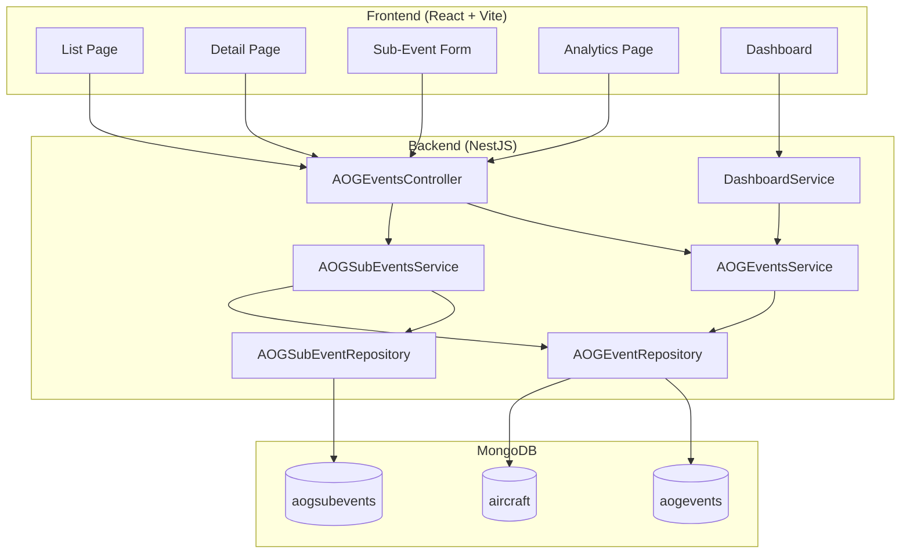
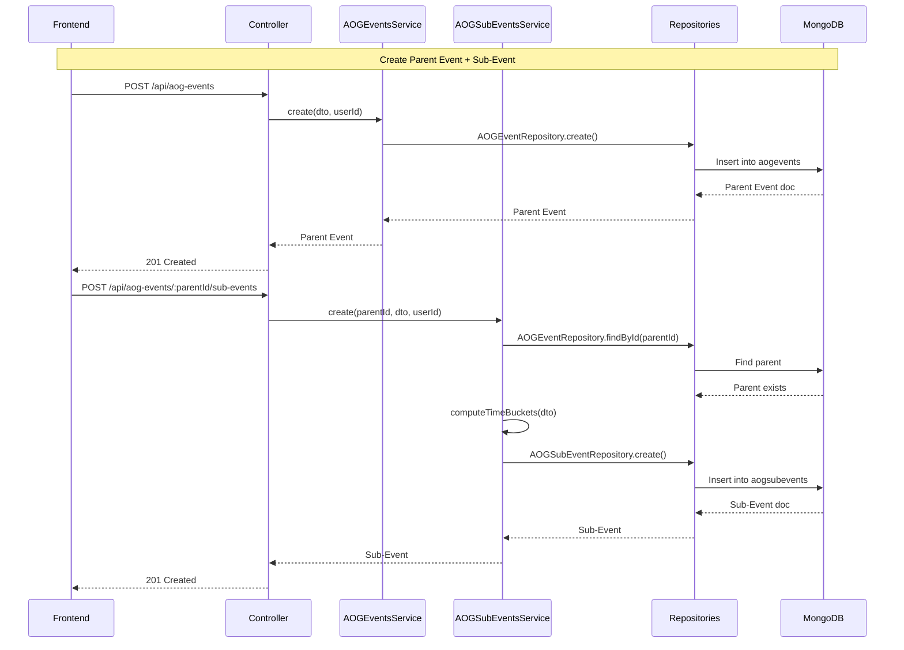

# Design Document: AOG Events Revamp

## Overview

This design replaces the flat, single-event AOG model with a hierarchical Parent Event / Sub-Event architecture. The current `aogevents` collection stores everything in one document — categories, milestones, workflow states, part requests, cost audit trails, and 18-state workflow logic. This revamp strips it down to a clean parent-child model where:

- A **Parent Event** is a lightweight skeleton representing one aircraft grounding incident (no category, no milestones, no workflow state).
- **Sub-Events** are children stored in a new `aogsubevents` collection, each representing a specific maintenance activity (AOG, Scheduled, or Unscheduled) with its own timeline.
- **Department Handoffs** are embedded sub-documents within Sub-Events, replacing the static procurement milestone timestamps with a dynamic repeater pattern supporting Procurement, Engineering, Quality, and Operations departments.
- **Time Buckets** are computed as Technical_Time (sub-event duration minus handoff durations) and per-department time (sum of handoff durations grouped by department).

The user has confirmed all existing AOG data has been deleted, so this is a clean-slate migration with no data compatibility concerns. The old schema fields, enums, workflow logic, and analytics components are removed entirely.

### Key Design Decisions

1. **Separate collection for Sub-Events** (`aogsubevents`) rather than embedding — allows independent querying, pagination, and analytics aggregation without loading entire parent documents.
2. **Embedded Department Handoffs** within Sub-Events — handoffs are always accessed in the context of their sub-event, and the array is bounded (typically 1-5 entries), making embedding the right choice.
3. **Computed metrics stored on Sub-Events** — Technical_Time and departmentTimeTotals are recomputed on every handoff change and stored for query performance.
4. **Parent Event status derived from Sub-Events** — no stored status field; active/completed is computed from Sub-Event clearedAt values.
5. **Analytics driven by Sub-Events** — Parent Events are skeleton containers; all meaningful metrics come from Sub-Event aggregation.
6. **Dashboard integration via AOGEventsService** — the dashboard service continues to call `countActiveAOGEvents()` and similar methods, which are updated to query the new model.

## Architecture

### System Context



### Request Flow



### Module Structure

The existing `AOGEventsModule` is extended to register the new Sub-Event schema, repository, and service:

```
backend/src/aog-events/
├── aog-events.module.ts              # Updated: registers SubEvent schema + providers
├── aog-events.controller.ts          # Updated: parent CRUD + sub-event + handoff routes
├── schemas/
│   ├── aog-event.schema.ts           # Rewritten: clean Parent Event schema
│   └── aog-sub-event.schema.ts       # NEW: Sub-Event + DepartmentHandoff schema
├── dto/
│   ├── create-aog-event.dto.ts       # Rewritten: parent event fields only
│   ├── update-aog-event.dto.ts       # Rewritten: mutable parent fields
│   ├── create-sub-event.dto.ts       # NEW
│   ├── update-sub-event.dto.ts       # NEW
│   ├── create-handoff.dto.ts         # NEW
│   ├── update-handoff.dto.ts         # NEW
│   └── filter-aog-event.dto.ts       # Updated: new filter options
├── repositories/
│   ├── aog-event.repository.ts       # Rewritten: simplified queries
│   └── aog-sub-event.repository.ts   # NEW
├── services/
│   ├── aog-events.service.ts         # Rewritten: parent event logic + analytics
│   └── aog-sub-events.service.ts     # NEW: sub-event + handoff logic + time computation
```

## Components and Interfaces

### Backend Components

#### 1. AOGEventsController

Single controller handling all three resource levels via nested routes:

```typescript
// Parent Event routes
POST   /api/aog-events                                          → create parent
GET    /api/aog-events                                          → list parents (filtered)
GET    /api/aog-events/active                                   → list active parents
GET    /api/aog-events/active/count                             → count active parents
GET    /api/aog-events/analytics/summary                        → analytics summary
GET    /api/aog-events/analytics/category-breakdown             → category breakdown
GET    /api/aog-events/analytics/time-breakdown                 → time breakdown
GET    /api/aog-events/:id                                      → get parent + sub-events + metrics
PUT    /api/aog-events/:id                                      → update parent
DELETE /api/aog-events/:id                                      → delete parent + cascade sub-events

// Sub-Event routes (nested under parent)
POST   /api/aog-events/:parentId/sub-events                     → create sub-event
GET    /api/aog-events/:parentId/sub-events                     → list sub-events for parent
GET    /api/aog-events/:parentId/sub-events/:subId              → get single sub-event
PUT    /api/aog-events/:parentId/sub-events/:subId              → update sub-event
DELETE /api/aog-events/:parentId/sub-events/:subId              → delete sub-event

// Department Handoff routes (nested under sub-event)
POST   /api/aog-events/:parentId/sub-events/:subId/handoffs     → add handoff
PUT    /api/aog-events/:parentId/sub-events/:subId/handoffs/:handoffId → update handoff
DELETE /api/aog-events/:parentId/sub-events/:subId/handoffs/:handoffId → remove handoff
```

#### 2. AOGEventsService

Handles Parent Event CRUD, analytics aggregation, and dashboard integration:

```typescript
interface AOGEventsService {
  // CRUD
  create(dto: CreateAOGEventDto, userId: string): Promise<AOGEventDocument>;
  findById(id: string): Promise<ParentEventWithSubEvents | null>;
  findAll(filter?: AOGEventFilter): Promise<ParentEventListItem[]>;
  update(id: string, dto: UpdateAOGEventDto, userId: string): Promise<AOGEventDocument>;
  delete(id: string): Promise<void>;

  // Active events (used by dashboard)
  getActiveAOGEvents(): Promise<ParentEventListItem[]>;
  countActiveAOGEvents(): Promise<number>;

  // Analytics
  getAnalyticsSummary(filter: AnalyticsFilter): Promise<AnalyticsSummary>;
  getCategoryBreakdown(filter: AnalyticsFilter): Promise<CategoryBreakdown[]>;
  getTimeBreakdown(filter: AnalyticsFilter): Promise<TimeBreakdown>;
}
```

#### 3. AOGSubEventsService

Handles Sub-Event CRUD, Department Handoff management, and time bucket computation:

```typescript
interface AOGSubEventsService {
  // Sub-Event CRUD
  create(parentId: string, dto: CreateSubEventDto, userId: string): Promise<AOGSubEventDocument>;
  findByParentId(parentId: string): Promise<AOGSubEventDocument[]>;
  findById(parentId: string, subId: string): Promise<AOGSubEventDocument | null>;
  update(parentId: string, subId: string, dto: UpdateSubEventDto, userId: string): Promise<AOGSubEventDocument>;
  delete(parentId: string, subId: string): Promise<void>;

  // Department Handoff management
  addHandoff(parentId: string, subId: string, dto: CreateHandoffDto, userId: string): Promise<AOGSubEventDocument>;
  updateHandoff(parentId: string, subId: string, handoffId: string, dto: UpdateHandoffDto, userId: string): Promise<AOGSubEventDocument>;
  removeHandoff(parentId: string, subId: string, handoffId: string, userId: string): Promise<AOGSubEventDocument>;

  // Time computation
  computeTimeBuckets(subEvent: AOGSubEventDocument): TimeBucketResult;
}
```

#### 4. Repositories

```typescript
// AOGEventRepository — simplified
interface AOGEventRepository {
  create(data: Partial<AOGEvent>): Promise<AOGEventDocument>;
  findById(id: string): Promise<AOGEventDocument | null>;
  findAll(filter?: AOGEventFilter): Promise<AOGEventDocument[]>;
  update(id: string, data: Partial<AOGEvent>): Promise<AOGEventDocument | null>;
  delete(id: string): Promise<AOGEventDocument | null>;
  countActive(): Promise<number>;
  findActive(): Promise<AOGEventDocument[]>;
}

// AOGSubEventRepository — new
interface AOGSubEventRepository {
  create(data: Partial<AOGSubEvent>): Promise<AOGSubEventDocument>;
  findById(id: string): Promise<AOGSubEventDocument | null>;
  findByParentId(parentId: string): Promise<AOGSubEventDocument[]>;
  update(id: string, data: Partial<AOGSubEvent>): Promise<AOGSubEventDocument | null>;
  delete(id: string): Promise<AOGSubEventDocument | null>;
  deleteByParentId(parentId: string): Promise<number>;
  aggregate(pipeline: any[]): Promise<any[]>;
}
```

### Frontend Components

#### Page Hierarchy

```
/aog/list          → AOGListPage (Parent Event list with filters)
/aog/:id           → AOGDetailPage (Parent Event detail + Sub-Events)
/aog/analytics     → AOGAnalyticsPage (Simplified analytics)
```

#### Component Tree

```
AOGListPage
├── FilterBar (aircraft, fleet group, status, date range)
├── CreateEventDialog
│   └── ParentEventForm (aircraftId, detectedAt, location, notes)
└── EventsTable (registration, location, dates, categories, sub-event count, downtime, status)

AOGDetailPage
├── ParentEventHeader (registration, location, dates, status badge, edit controls)
├── TimeBreakdownSummary (technical time, per-department time bars)
├── SubEventsList
│   ├── AddSubEventButton → SubEventFormDialog
│   └── SubEventCard (expandable)
│       ├── SubEventHeader (category badge, reason, dates, times)
│       ├── DepartmentHandoffsList
│       │   ├── HandoffRow (department, sentAt, returnedAt, duration, notes)
│       │   └── AddHandoffButton
│       └── SubEventActions (edit, delete)
└── DeleteEventButton (Admin only, with confirmation)

SubEventFormDialog
├── CategorySelect (AOG, Scheduled, Unscheduled)
├── ReasonCodeInput
├── ActionTakenTextarea
├── DateTimePickers (detectedAt, clearedAt)
├── ManpowerInputs (count, hours)
├── DepartmentHandoffRepeater
│   ├── HandoffRow[]
│   │   ├── DepartmentSelect (Procurement, Engineering, Quality, Operations)
│   │   ├── SentAtPicker
│   │   ├── ReturnedAtPicker
│   │   ├── NotesInput
│   │   └── RemoveButton
│   └── AddHandoffButton
└── SubmitButton

AOGAnalyticsPage
├── FilterBar (aircraft, fleet group, category, date range)
├── SummaryCards (total events, active, completed, total downtime)
├── CategoryBreakdownChart (bar/pie by AOG/Scheduled/Unscheduled)
└── TimeBreakdownChart (stacked horizontal bar: technical vs departments)
```

#### Custom Hooks

```typescript
// hooks/useAOGEvents.ts — rewritten
function useAOGEvents(filters?: AOGEventFilter)           // GET /api/aog-events
function useAOGEventById(id: string)                       // GET /api/aog-events/:id (with sub-events)
function useCreateAOGEvent()                               // POST /api/aog-events
function useUpdateAOGEvent()                               // PUT /api/aog-events/:id
function useDeleteAOGEvent()                               // DELETE /api/aog-events/:id

// hooks/useAOGSubEvents.ts — new
function useSubEvents(parentId: string)                    // GET /api/aog-events/:parentId/sub-events
function useCreateSubEvent()                               // POST /api/aog-events/:parentId/sub-events
function useUpdateSubEvent()                               // PUT /api/aog-events/:parentId/sub-events/:subId
function useDeleteSubEvent()                               // DELETE /api/aog-events/:parentId/sub-events/:subId
function useAddHandoff()                                   // POST .../handoffs
function useUpdateHandoff()                                // PUT .../handoffs/:handoffId
function useRemoveHandoff()                                // DELETE .../handoffs/:handoffId

// hooks/useAOGAnalytics.ts — new (replaces old analytics hooks)
function useAOGAnalyticsSummary(filter: AnalyticsFilter)   // GET /api/aog-events/analytics/summary
function useAOGCategoryBreakdown(filter: AnalyticsFilter)  // GET /api/aog-events/analytics/category-breakdown
function useAOGTimeBreakdown(filter: AnalyticsFilter)      // GET /api/aog-events/analytics/time-breakdown
```

### Request/Response Shapes

#### Create Parent Event

```typescript
// POST /api/aog-events
// Request
interface CreateAOGEventDto {
  aircraftId: string;       // MongoDB ObjectId
  detectedAt: string;       // ISO 8601 datetime
  clearedAt?: string;       // ISO 8601 datetime (optional)
  location?: string;        // ICAO code (e.g., "OERK")
  notes?: string;
}

// Response: 201
interface ParentEventResponse {
  id: string;
  aircraftId: string;
  aircraft?: { id: string; registration: string; fleetGroup: string };
  detectedAt: string;
  clearedAt: string | null;
  location: string | null;
  notes: string | null;
  attachments: string[];
  totalDowntimeHours: number;
  status: 'active' | 'completed';
  categories: string[];          // derived from sub-events
  subEventCount: number;
  totalTechnicalTime: number;
  totalDepartmentTime: number;
  createdAt: string;
  updatedAt: string;
}
```

#### Get Parent Event (with Sub-Events)

```typescript
// GET /api/aog-events/:id
// Response: 200
interface ParentEventDetailResponse extends ParentEventResponse {
  subEvents: SubEventResponse[];
}

interface SubEventResponse {
  id: string;
  parentEventId: string;
  category: 'aog' | 'scheduled' | 'unscheduled';
  reasonCode: string;
  actionTaken: string;
  detectedAt: string;
  clearedAt: string | null;
  manpowerCount: number;
  manHours: number;
  departmentHandoffs: DepartmentHandoffResponse[];
  technicalTimeHours: number;
  departmentTimeHours: number;
  departmentTimeTotals: Record<string, number>;  // { Procurement: 12.5, Engineering: 3.0, ... }
  totalDowntimeHours: number;
  notes: string | null;
  status: 'active' | 'completed';
  createdAt: string;
  updatedAt: string;
}

interface DepartmentHandoffResponse {
  id: string;
  department: 'Procurement' | 'Engineering' | 'Quality' | 'Operations';
  sentAt: string;
  returnedAt: string | null;
  durationHours: number;
  notes: string | null;
}
```

#### Create Sub-Event

```typescript
// POST /api/aog-events/:parentId/sub-events
interface CreateSubEventDto {
  category: 'aog' | 'scheduled' | 'unscheduled';
  reasonCode: string;
  actionTaken: string;
  detectedAt: string;
  clearedAt?: string;
  manpowerCount: number;
  manHours: number;
  departmentHandoffs?: CreateHandoffDto[];
  notes?: string;
}
```

#### Department Handoff

```typescript
// POST /api/aog-events/:parentId/sub-events/:subId/handoffs
interface CreateHandoffDto {
  department: 'Procurement' | 'Engineering' | 'Quality' | 'Operations';
  sentAt: string;
  returnedAt?: string;
  notes?: string;
}

// PUT /api/aog-events/:parentId/sub-events/:subId/handoffs/:handoffId
interface UpdateHandoffDto {
  department?: 'Procurement' | 'Engineering' | 'Quality' | 'Operations';
  sentAt?: string;
  returnedAt?: string;
  notes?: string;
}
```

#### Analytics Responses

```typescript
// GET /api/aog-events/analytics/summary
interface AnalyticsSummary {
  totalParentEvents: number;
  activeParentEvents: number;
  completedParentEvents: number;
  totalSubEvents: number;
  totalDowntimeHours: number;
}

// GET /api/aog-events/analytics/category-breakdown
interface CategoryBreakdownItem {
  category: 'aog' | 'scheduled' | 'unscheduled';
  subEventCount: number;
  totalDowntimeHours: number;
  percentage: number;
}

// GET /api/aog-events/analytics/time-breakdown
interface TimeBreakdown {
  technicalTimeHours: number;
  technicalTimePercentage: number;
  departmentTotals: {
    department: string;
    totalHours: number;
    percentage: number;
  }[];
  grandTotalHours: number;
}
```

## Data Models

### Parent Event Schema (`aogevents` collection)

```typescript
@Schema(baseSchemaOptions)
export class AOGEvent {
  @Prop({ type: Types.ObjectId, ref: 'Aircraft', required: true, index: true })
  aircraftId: Types.ObjectId;

  @Prop({ required: true })
  detectedAt: Date;

  @Prop()
  clearedAt?: Date;

  @Prop()
  location?: string;  // ICAO airport code

  @Prop()
  notes?: string;

  @Prop({ type: [String], default: [] })
  attachments: string[];  // S3 keys

  @Prop({ type: Types.ObjectId, ref: 'User', required: true })
  updatedBy: Types.ObjectId;

  // Computed (stored for query performance)
  @Prop({ min: 0, default: 0 })
  totalDowntimeHours: number;

  createdAt?: Date;
  updatedAt?: Date;
}
```

**Removed fields:** category, reasonCode, responsibleParty, actionTaken, manpowerCount, manHours, currentStatus, blockingReason, statusHistory, partRequests, costLabor, costParts, costExternal, estimatedCostLabor, estimatedCostParts, estimatedCostExternal, budgetClauseId, budgetPeriod, isBudgetAffecting, linkedActualSpendId, costAuditTrail, attachmentsMeta, isLegacy, reportedAt, procurementRequestedAt, availableAtStoreAt, issuedBackAt, installationCompleteAt, testStartAt, upAndRunningAt, technicalTimeHours, procurementTimeHours, opsTimeHours, internalCost, externalCost, milestoneHistory, isImported, isDemo.

**Indexes:**
- `{ aircraftId: 1, detectedAt: -1 }` — primary query pattern
- `{ detectedAt: -1 }` — date-based listing
- `{ clearedAt: 1 }` — active event queries (null = active)

**Virtuals:**
- `status`: returns `'active'` if `clearedAt` is null, `'completed'` otherwise

### Sub-Event Schema (`aogsubevents` collection)

```typescript
// Embedded sub-document
@Schema({ _id: true })
export class DepartmentHandoff {
  @Prop({ type: Types.ObjectId, default: () => new Types.ObjectId() })
  _id: Types.ObjectId;

  @Prop({ required: true, enum: ['Procurement', 'Engineering', 'Quality', 'Operations'] })
  department: string;

  @Prop({ required: true })
  sentAt: Date;

  @Prop()
  returnedAt?: Date;

  @Prop()
  notes?: string;
}

@Schema(baseSchemaOptions)
export class AOGSubEvent {
  @Prop({ type: Types.ObjectId, ref: 'AOGEvent', required: true, index: true })
  parentEventId: Types.ObjectId;

  @Prop({ required: true, enum: ['aog', 'scheduled', 'unscheduled'] })
  category: string;

  @Prop({ required: true })
  reasonCode: string;

  @Prop({ required: true })
  actionTaken: string;

  @Prop({ required: true })
  detectedAt: Date;

  @Prop()
  clearedAt?: Date;

  @Prop({ required: true, min: 0 })
  manpowerCount: number;

  @Prop({ required: true, min: 0 })
  manHours: number;

  @Prop({ type: [DepartmentHandoffSchema], default: [] })
  departmentHandoffs: DepartmentHandoff[];

  @Prop()
  notes?: string;

  @Prop({ type: Types.ObjectId, ref: 'User', required: true })
  updatedBy: Types.ObjectId;

  // Computed metrics (stored for query performance)
  @Prop({ min: 0, default: 0 })
  technicalTimeHours: number;

  @Prop({ min: 0, default: 0 })
  departmentTimeHours: number;

  @Prop({ type: Object, default: {} })
  departmentTimeTotals: Record<string, number>;  // e.g., { Procurement: 12.5, Engineering: 3.0 }

  @Prop({ min: 0, default: 0 })
  totalDowntimeHours: number;

  createdAt?: Date;
  updatedAt?: Date;
}
```

**Indexes:**
- `{ parentEventId: 1, detectedAt: -1 }` — primary query pattern
- `{ parentEventId: 1 }` — cascade delete
- `{ category: 1, detectedAt: -1 }` — analytics by category
- `{ detectedAt: -1 }` — date-based analytics

### Time Bucket Computation Algorithm

```typescript
function computeTimeBuckets(subEvent: AOGSubEvent): TimeBucketResult {
  const endTime = subEvent.clearedAt || new Date();
  const totalDurationMs = endTime.getTime() - subEvent.detectedAt.getTime();
  const totalDowntimeHours = Math.max(0, totalDurationMs / (1000 * 60 * 60));

  // Sum handoff durations, grouped by department
  const departmentTimeTotals: Record<string, number> = {};
  let totalDepartmentTimeMs = 0;

  for (const handoff of subEvent.departmentHandoffs) {
    const handoffEnd = handoff.returnedAt || new Date();
    const durationMs = Math.max(0, handoffEnd.getTime() - handoff.sentAt.getTime());
    totalDepartmentTimeMs += durationMs;

    const dept = handoff.department;
    const durationHours = durationMs / (1000 * 60 * 60);
    departmentTimeTotals[dept] = (departmentTimeTotals[dept] || 0) + durationHours;
  }

  const departmentTimeHours = totalDepartmentTimeMs / (1000 * 60 * 60);
  // Technical time = total duration - department time, floored at 0
  const technicalTimeHours = Math.max(0, totalDowntimeHours - departmentTimeHours);

  return {
    technicalTimeHours,
    departmentTimeHours,
    departmentTimeTotals,
    totalDowntimeHours,
  };
}
```

This function is called:
- On Sub-Event create (in `AOGSubEventsService.create()`)
- On Sub-Event update (in `AOGSubEventsService.update()`)
- On Handoff add/update/remove (in the respective handoff methods)

The results are stored on the Sub-Event document via `$set` for query performance.

### Dashboard Integration

The `DashboardService` currently calls:
- `aogEventsService.countActiveAOGEvents()` — updated to count Parent Events where `clearedAt` is null
- `aogEventModel.find({ clearedAt: null })` — updated to query the simplified Parent Event model
- `aogEventModel.find({ clearedAt: { $ne: null } })` — for MTTR, uses Parent Event `detectedAt` → `clearedAt`

The dashboard service's direct `aogEventModel` queries are updated to work with the new lean schema (no `responsibleParty`, no `currentStatus`, no `blockingReason`). Alert generation is simplified: critical alert for any active Parent Event, warning alert for Parent Events active > 48 hours.

### Cleanup Scope

**Backend removals:**
- Enums: `ResponsibleParty`, `AOGWorkflowStatus`, `BlockingReason`, `PartRequestStatus`
- Sub-document schemas: `MilestoneHistoryEntry`, `StatusHistoryEntry`, `PartRequest`, `CostAuditEntry`, `AttachmentMeta`
- Category values: `MRO`, `Cleaning` from `AOGCategory` enum (enum moves to Sub-Event schema)
- Service methods: `transitionStatus`, `getStatusHistory`, `addPartRequest`, `updatePartRequest`, `generateActualSpend`, `updateBudgetIntegration`, `getStageBreakdown`, `getBottleneckAnalytics`, `getThreeBucketAnalytics`, `getLocationHeatmap`, `getDurationDistribution`, `getAircraftReliability`, `getMonthlyTrend`, `getInsights`, `generateForecast`, and all private helper methods for the old analytics
- Controller routes: `/transition-status`, `/part-requests`, `/budget-integration`, old analytics endpoints
- Old indexes: `responsibleParty`, `currentStatus`, `blockingReason`, `reportedAt` indexes

**Frontend removals:**
- Components: `MilestoneTimeline`, `MilestoneEditForm`, `ThreeBucketChart`, `AttachmentsTab`, `ForecastChart`, `RiskScoreGauge`, `ReliabilityScoreCards`, `WaterfallChart`, `BucketTrendChart`, `MovingAverageChart`, `YearOverYearChart`, `AircraftHeatmap`, `ParetoChart`, `CostBreakdownChart`, `CostEfficiencyMetrics`, `AOGDataQualityIndicator`, `EnhancedAOGAnalyticsPDFExport`, `CategoryBreakdownPie`, `ResponsibilityDistributionChart`, `MonthlyTrendChart`
- Utility files: `reliabilityScore.ts`, `riskScore.ts`, `costAnalysis.ts`, `sampleData.ts`
- Old hooks: all analytics hooks in `useAOGEvents.ts` (replaced by `useAOGAnalytics.ts`)
- Old pages: `AOGAnalyticsPageEnhanced.tsx`, `AOGLogPage.tsx`


## Correctness Properties

*A property is a characteristic or behavior that should hold true across all valid executions of a system — essentially, a formal statement about what the system should do. Properties serve as the bridge between human-readable specifications and machine-verifiable correctness guarantees.*

### Property 1: Parent Event round-trip persistence

*For any* valid Parent Event input (aircraftId, detectedAt, clearedAt, location, notes), creating the event via the API and then retrieving it by ID should return a record with identical field values.

**Validates: Requirements 1.1, 5.1, 5.3, 5.4, 16.1, 16.2**

### Property 2: Parent Event status derivation from Sub-Events

*For any* Parent Event with N Sub-Events, the Parent Event status should be `'active'` if at least one Sub-Event has `clearedAt === null`, and `'completed'` if all Sub-Events have a non-null `clearedAt`. A Parent Event with zero Sub-Events and no `clearedAt` should be `'active'`.

**Validates: Requirements 1.5, 1.6**

### Property 3: Parent Event totalDowntimeHours computation

*For any* Parent Event with `detectedAt` and `clearedAt`, `totalDowntimeHours` should equal `(clearedAt - detectedAt)` converted to hours. For active events (no `clearedAt`), `totalDowntimeHours` should equal `(now - detectedAt)` in hours, and should always be >= 0.

**Validates: Requirements 1.7**

### Property 4: Sub-Event round-trip persistence with embedded handoffs

*For any* valid Sub-Event input (category, reasonCode, actionTaken, detectedAt, clearedAt, manpowerCount, manHours, departmentHandoffs array), creating the sub-event under a parent and then retrieving it should return a record with identical field values, including all embedded Department Handoff entries with their department, sentAt, returnedAt, and notes fields preserved.

**Validates: Requirements 2.1, 3.1, 3.2, 6.1, 6.2, 6.3, 6.4**

### Property 5: Sub-Event category validation

*For any* string value, creating a Sub-Event with that value as `category` should succeed if and only if the value is one of `'aog'`, `'scheduled'`, or `'unscheduled'`. All other values (including `'mro'` and `'cleaning'`) should be rejected with a validation error.

**Validates: Requirements 2.2, 2.3**

### Property 6: Sub-Event temporal validation

*For any* Sub-Event where `clearedAt` is provided, the system should reject the input if `clearedAt < detectedAt` and accept it if `clearedAt >= detectedAt`.

**Validates: Requirements 2.5**

### Property 7: Sub-Event totalDowntimeHours computation

*For any* Sub-Event with `detectedAt` and `clearedAt`, `totalDowntimeHours` should equal `(clearedAt - detectedAt)` converted to hours. For active sub-events, it should use current time. The value should always be >= 0.

**Validates: Requirements 2.7**

### Property 8: Department Handoff temporal validation

*For any* Department Handoff where `returnedAt` is provided, the system should reject the input if `returnedAt < sentAt` and accept it if `returnedAt >= sentAt`.

**Validates: Requirements 3.4, 10.5**

### Property 9: Department Handoff duration computation

*For any* Department Handoff with `sentAt` and `returnedAt`, the computed `durationHours` should equal `(returnedAt - sentAt)` converted to hours, and should always be >= 0.

**Validates: Requirements 3.5**

### Property 10: Time bucket computation correctness

*For any* Sub-Event with N Department Handoffs (each having sentAt and returnedAt), the following should hold:
- `departmentTimeHours` equals the sum of all individual handoff durations
- `departmentTimeTotals[dept]` equals the sum of durations for handoffs with that department
- `technicalTimeHours` equals `max(0, totalDowntimeHours - departmentTimeHours)`
- The sum of all `departmentTimeTotals` values equals `departmentTimeHours`

**Validates: Requirements 4.1, 4.2, 4.3, 4.4, 4.5**

### Property 11: Time bucket recomputation on handoff mutation

*For any* Sub-Event, after adding, updating, or removing a Department Handoff, the Sub-Event's stored `technicalTimeHours`, `departmentTimeHours`, and `departmentTimeTotals` should reflect the current state of the handoffs array (i.e., recomputing from scratch on the current handoffs should yield the same stored values).

**Validates: Requirements 4.6, 6.6, 7.4**

### Property 12: Cascade delete

*For any* Parent Event with N Sub-Events, deleting the Parent Event should result in all N Sub-Events also being deleted. After deletion, querying for the parent ID or any of its sub-event IDs should return null/empty.

**Validates: Requirements 5.5**

### Property 13: Parent Event derived categories and aggregate metrics

*For any* Parent Event with Sub-Events, the `categories` array should equal the distinct set of `category` values from its Sub-Events. The aggregate `totalTechnicalTime` should equal the sum of `technicalTimeHours` across all Sub-Events, and `totalDepartmentTime` should equal the sum of `departmentTimeHours` across all Sub-Events.

**Validates: Requirements 5.6, 5.7**

### Property 14: List filtering correctness

*For any* filter combination (aircraftId, fleetGroup, status, startDate, endDate), every Parent Event in the returned list should match all specified filter criteria. No event that matches the criteria should be excluded.

**Validates: Requirements 5.2, 8.5, 11.4**

### Property 15: Analytics summary computation

*For any* set of Parent Events and Sub-Events matching a filter, the analytics summary should return: `totalParentEvents` = count of matching parent events, `activeParentEvents` = count where clearedAt is null, `completedParentEvents` = count where clearedAt is not null, `totalSubEvents` = count of sub-events under matching parents, `totalDowntimeHours` = sum of parent event downtime hours.

**Validates: Requirements 11.1**

### Property 16: Analytics category breakdown

*For any* set of Sub-Events matching a filter, the category breakdown should return one entry per distinct category, where each entry's `subEventCount` equals the count of sub-events with that category, `totalDowntimeHours` equals the sum of their downtime, and `percentage` equals `(categoryDowntime / totalDowntime) * 100`. The percentages should sum to 100 (within floating-point tolerance).

**Validates: Requirements 11.2**

### Property 17: Analytics time breakdown

*For any* set of Sub-Events matching a filter, the time breakdown should return `technicalTimeHours` equal to the sum of all sub-events' `technicalTimeHours`, and each department total equal to the sum of that department's time across all sub-events. `technicalTimePercentage + sum(departmentPercentages)` should equal 100 (within floating-point tolerance).

**Validates: Requirements 11.3**

### Property 18: Dashboard active AOG count and total downtime

*For any* set of Parent Events, the dashboard's active AOG count should equal the number of Parent Events where `clearedAt` is null. The total downtime hours should equal the sum of `totalDowntimeHours` across all Parent Events in the current period.

**Validates: Requirements 13.1, 13.5**

### Property 19: Dashboard MTTR computation

*For any* set of completed Parent Events (clearedAt is not null), MTTR should equal the average of `(clearedAt - detectedAt)` in hours across all completed events. If there are zero completed events, MTTR should be 0.

**Validates: Requirements 13.2**

### Property 20: Dashboard AOG alerts generation

*For any* set of Parent Events, a critical alert should be generated for each Parent Event where `clearedAt` is null. A warning alert should be generated for each active Parent Event where `(now - detectedAt)` exceeds 48 hours. No alert should be generated for completed events.

**Validates: Requirements 13.3**

## Error Handling

### Backend Error Handling

| Scenario | Exception | HTTP Status | Message |
|----------|-----------|-------------|---------|
| Parent Event not found | `NotFoundException` | 404 | `AOG event with ID {id} not found` |
| Sub-Event not found | `NotFoundException` | 404 | `Sub-event with ID {subId} not found` |
| Handoff not found | `NotFoundException` | 404 | `Handoff with ID {handoffId} not found` |
| Parent ID mismatch (sub-event doesn't belong to parent) | `NotFoundException` | 404 | `Sub-event with ID {subId} not found under parent {parentId}` |
| Invalid aircraftId reference | `BadRequestException` | 400 | `Aircraft with ID {aircraftId} not found` |
| Invalid parentEventId reference | `BadRequestException` | 400 | `Parent event with ID {parentId} not found` |
| clearedAt < detectedAt | `BadRequestException` | 400 | `clearedAt must be greater than or equal to detectedAt` |
| returnedAt < sentAt | `BadRequestException` | 400 | `returnedAt must be greater than or equal to sentAt` |
| Invalid category value | `BadRequestException` | 400 | `category must be one of: aog, scheduled, unscheduled` |
| Invalid department value | `BadRequestException` | 400 | `department must be one of: Procurement, Engineering, Quality, Operations` |
| Missing required fields | `BadRequestException` | 400 | Validation pipe auto-generates field-specific messages |
| Unauthorized (no JWT) | `UnauthorizedException` | 401 | `Unauthorized` |
| Forbidden (non-Admin delete) | `ForbiddenException` | 403 | `Forbidden resource` |
| Invalid ObjectId format | `BadRequestException` | 400 | `Invalid ID format` |

### Frontend Error Handling

- All mutation errors display a toast notification via the existing toast system (`sonner` or equivalent).
- Network errors show a generic "Failed to connect to server" toast.
- 401 errors trigger redirect to login page via the `AuthContext`.
- 403 errors show "You don't have permission to perform this action" toast.
- Form validation errors are displayed inline next to the relevant field using React Hook Form + Zod error messages.
- List/detail page fetch errors show an error state component with a "Retry" button.
- Analytics chart fetch errors show a per-section error boundary with retry capability (using the existing `AnalyticsSectionErrorBoundary` pattern).

### Data Integrity

- Cascade delete: when a Parent Event is deleted, all Sub-Events are deleted in the same operation using `AOGSubEventRepository.deleteByParentId()`. This is done before the parent delete to avoid orphaned sub-events.
- Referential integrity: Sub-Event creation validates that `parentEventId` exists before inserting.
- Time bucket recomputation: every handoff mutation triggers a recompute-and-save cycle. If the save fails, the handoff mutation is also rolled back (the handoff update and metric recompute happen in a single `findByIdAndUpdate` with `$set` for metrics).

## Testing Strategy

### Dual Testing Approach

This feature uses both unit tests and property-based tests for comprehensive coverage:

- **Unit tests** (Jest): Verify specific examples, edge cases, integration points, and error conditions. Focus on API contract validation, error responses, and UI component rendering.
- **Property-based tests** (fast-check): Verify universal properties across randomly generated inputs. Each property test references a specific Correctness Property from this design document.

### Property-Based Testing Configuration

- **Library**: `fast-check` (npm package `fast-check`) for TypeScript/JavaScript property-based testing
- **Minimum iterations**: 100 per property test
- **Tag format**: Each test includes a comment: `// Feature: aog-events-revamp, Property {N}: {title}`
- **Each correctness property is implemented by a single property-based test**

### Test Organization

```
backend/src/aog-events/
├── __tests__/
│   ├── aog-events.service.spec.ts          # Unit tests for parent event service
│   ├── aog-sub-events.service.spec.ts      # Unit tests for sub-event service
│   ├── time-buckets.spec.ts                # Unit + property tests for time computation
│   ├── time-buckets.property.spec.ts       # Property tests for Properties 3, 7, 9, 10, 11
│   ├── analytics.spec.ts                   # Unit + property tests for analytics
│   └── analytics.property.spec.ts          # Property tests for Properties 15, 16, 17
backend/test/
│   └── aog-events.e2e-spec.ts              # E2E tests for API contracts

frontend/src/
├── hooks/__tests__/
│   ├── useAOGEvents.test.ts                # Hook tests with MSW mocks
│   └── useAOGSubEvents.test.ts             # Hook tests with MSW mocks
├── pages/aog/__tests__/
│   ├── AOGListPage.test.tsx                # List page rendering + filtering
│   └── AOGDetailPage.test.tsx              # Detail page rendering + sub-events
```

### Unit Test Focus Areas

- **API contract tests**: Verify request/response shapes for all endpoints
- **Validation tests**: Invalid category values, temporal constraint violations, missing required fields
- **Cascade delete**: Verify sub-events are deleted when parent is deleted
- **Dashboard integration**: Verify `countActiveAOGEvents()` and MTTR computation with the new model
- **Error responses**: Verify correct HTTP status codes and error messages
- **Auth/role tests**: Verify 401 for unauthenticated, 403 for non-Admin delete

### Property Test Focus Areas

- **Time bucket computation** (Properties 3, 7, 9, 10, 11): Generate random sub-events with random handoff configurations and verify all time calculations are correct
- **Round-trip persistence** (Properties 1, 4): Generate random valid inputs, create via API, retrieve, and verify equality
- **Status derivation** (Property 2): Generate random parent events with varying sub-event states and verify status logic
- **Analytics aggregation** (Properties 15, 16, 17): Generate random event datasets and verify aggregation correctness
- **Filtering** (Property 14): Generate random events and random filter combinations, verify all returned events match filters
- **Validation** (Properties 5, 6, 8): Generate random invalid inputs and verify rejection

### Generators (fast-check Arbitraries)

Key generators needed for property tests:

```typescript
// Valid ICAO airport code
const icaoCodeArb = fc.stringOf(fc.constantFrom(...'ABCDEFGHIJKLMNOPQRSTUVWXYZ'.split('')), { minLength: 4, maxLength: 4 });

// Valid category
const categoryArb = fc.constantFrom('aog', 'scheduled', 'unscheduled');

// Valid department
const departmentArb = fc.constantFrom('Procurement', 'Engineering', 'Quality', 'Operations');

// Date pair where end >= start
const dateRangeArb = fc.tuple(fc.date(), fc.nat({ max: 365 * 24 * 60 * 60 * 1000 }))
  .map(([start, offsetMs]) => ({ start, end: new Date(start.getTime() + offsetMs) }));

// Department Handoff with valid timestamps
const handoffArb = fc.tuple(departmentArb, dateRangeArb, fc.option(fc.string()))
  .map(([department, { start, end }, notes]) => ({
    department,
    sentAt: start,
    returnedAt: end,
    notes: notes ?? undefined,
  }));

// Sub-Event with random handoffs
const subEventArb = fc.tuple(
  categoryArb,
  fc.string({ minLength: 1 }),  // reasonCode
  fc.string({ minLength: 1 }),  // actionTaken
  dateRangeArb,                  // detectedAt → clearedAt
  fc.nat({ max: 20 }),          // manpowerCount
  fc.float({ min: 0, max: 1000 }), // manHours
  fc.array(handoffArb, { maxLength: 5 }),
).map(([category, reasonCode, actionTaken, { start, end }, manpowerCount, manHours, handoffs]) => ({
  category,
  reasonCode,
  actionTaken,
  detectedAt: start,
  clearedAt: end,
  manpowerCount,
  manHours,
  departmentHandoffs: handoffs,
}));
```

