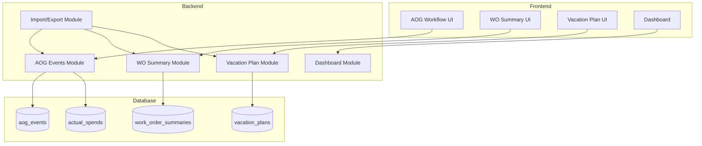
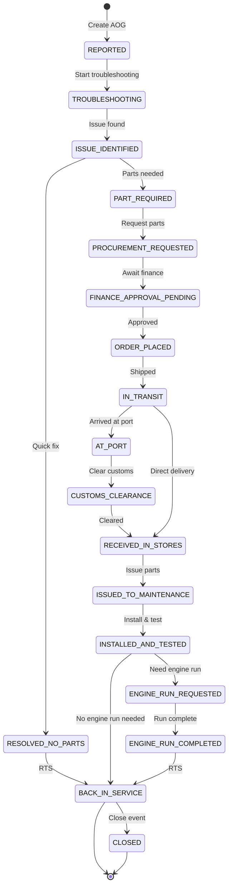

# Design Document: AOG Workflow, Work Orders Simplification & Vacation Plan

## Overview

This design document details the technical implementation for three major features in the Alpha Star Aviation KPIs Dashboard:

1. **AOG Workflow Revamp**: Transform AOG events from single-shot records into a stateful workflow with 18 states, status history tracking, blocking reasons, parts/procurement lifecycle, and cost tracking with optional budget integration.

2. **Work Orders Simplification**: Replace granular work orders with a monthly per-aircraft summary model, preserving existing detailed records as read-only historical data.

3. **Vacation Plan Module**: New module for managing Engineering and TPL team vacation schedules with a 48-week grid UI and Excel-compatible import/export.

The implementation uses the existing technology stack: NestJS backend with MongoDB/Mongoose, React frontend with TanStack Query, and xlsx for Excel operations.

## Architecture

### High-Level Component Diagram



### AOG Workflow State Machine



## Components and Interfaces

### 1. AOG Events Module (Extended)

#### New Enums

```typescript
// backend/src/aog-events/schemas/aog-event.schema.ts

export enum AOGWorkflowStatus {
  REPORTED = 'REPORTED',
  TROUBLESHOOTING = 'TROUBLESHOOTING',
  ISSUE_IDENTIFIED = 'ISSUE_IDENTIFIED',
  RESOLVED_NO_PARTS = 'RESOLVED_NO_PARTS',
  PART_REQUIRED = 'PART_REQUIRED',
  PROCUREMENT_REQUESTED = 'PROCUREMENT_REQUESTED',
  FINANCE_APPROVAL_PENDING = 'FINANCE_APPROVAL_PENDING',
  ORDER_PLACED = 'ORDER_PLACED',
  IN_TRANSIT = 'IN_TRANSIT',
  AT_PORT = 'AT_PORT',
  CUSTOMS_CLEARANCE = 'CUSTOMS_CLEARANCE',
  RECEIVED_IN_STORES = 'RECEIVED_IN_STORES',
  ISSUED_TO_MAINTENANCE = 'ISSUED_TO_MAINTENANCE',
  INSTALLED_AND_TESTED = 'INSTALLED_AND_TESTED',
  ENGINE_RUN_REQUESTED = 'ENGINE_RUN_REQUESTED',
  ENGINE_RUN_COMPLETED = 'ENGINE_RUN_COMPLETED',
  BACK_IN_SERVICE = 'BACK_IN_SERVICE',
  CLOSED = 'CLOSED',
}

export enum BlockingReason {
  Finance = 'Finance',
  Port = 'Port',
  Customs = 'Customs',
  Vendor = 'Vendor',
  Ops = 'Ops',
  Other = 'Other',
}

export enum PartRequestStatus {
  REQUESTED = 'REQUESTED',
  APPROVED = 'APPROVED',
  ORDERED = 'ORDERED',
  SHIPPED = 'SHIPPED',
  RECEIVED = 'RECEIVED',
  ISSUED = 'ISSUED',
}
```

#### Status Transition Rules

```typescript
// Allowed transitions map
const ALLOWED_TRANSITIONS: Record<AOGWorkflowStatus, AOGWorkflowStatus[]> = {
  [AOGWorkflowStatus.REPORTED]: [AOGWorkflowStatus.TROUBLESHOOTING],
  [AOGWorkflowStatus.TROUBLESHOOTING]: [AOGWorkflowStatus.ISSUE_IDENTIFIED],
  [AOGWorkflowStatus.ISSUE_IDENTIFIED]: [
    AOGWorkflowStatus.RESOLVED_NO_PARTS,
    AOGWorkflowStatus.PART_REQUIRED,
  ],
  [AOGWorkflowStatus.RESOLVED_NO_PARTS]: [AOGWorkflowStatus.BACK_IN_SERVICE],
  [AOGWorkflowStatus.PART_REQUIRED]: [AOGWorkflowStatus.PROCUREMENT_REQUESTED],
  [AOGWorkflowStatus.PROCUREMENT_REQUESTED]: [AOGWorkflowStatus.FINANCE_APPROVAL_PENDING],
  [AOGWorkflowStatus.FINANCE_APPROVAL_PENDING]: [AOGWorkflowStatus.ORDER_PLACED],
  [AOGWorkflowStatus.ORDER_PLACED]: [AOGWorkflowStatus.IN_TRANSIT],
  [AOGWorkflowStatus.IN_TRANSIT]: [
    AOGWorkflowStatus.AT_PORT,
    AOGWorkflowStatus.RECEIVED_IN_STORES,
  ],
  [AOGWorkflowStatus.AT_PORT]: [AOGWorkflowStatus.CUSTOMS_CLEARANCE],
  [AOGWorkflowStatus.CUSTOMS_CLEARANCE]: [AOGWorkflowStatus.RECEIVED_IN_STORES],
  [AOGWorkflowStatus.RECEIVED_IN_STORES]: [AOGWorkflowStatus.ISSUED_TO_MAINTENANCE],
  [AOGWorkflowStatus.ISSUED_TO_MAINTENANCE]: [AOGWorkflowStatus.INSTALLED_AND_TESTED],
  [AOGWorkflowStatus.INSTALLED_AND_TESTED]: [
    AOGWorkflowStatus.ENGINE_RUN_REQUESTED,
    AOGWorkflowStatus.BACK_IN_SERVICE,
  ],
  [AOGWorkflowStatus.ENGINE_RUN_REQUESTED]: [AOGWorkflowStatus.ENGINE_RUN_COMPLETED],
  [AOGWorkflowStatus.ENGINE_RUN_COMPLETED]: [AOGWorkflowStatus.BACK_IN_SERVICE],
  [AOGWorkflowStatus.BACK_IN_SERVICE]: [AOGWorkflowStatus.CLOSED],
  [AOGWorkflowStatus.CLOSED]: [],
};

// Statuses that require blocking reason
const BLOCKING_STATUSES = [
  AOGWorkflowStatus.FINANCE_APPROVAL_PENDING,
  AOGWorkflowStatus.AT_PORT,
  AOGWorkflowStatus.CUSTOMS_CLEARANCE,
  AOGWorkflowStatus.IN_TRANSIT,
];
```

#### New API Endpoints

| Method | Endpoint | Description |
|--------|----------|-------------|
| POST | `/aog-events/:id/transitions` | Transition AOG to new status |
| GET | `/aog-events/:id/history` | Get status history timeline |
| POST | `/aog-events/:id/parts` | Create part request |
| PUT | `/aog-events/:id/parts/:partId` | Update part request |
| GET | `/aog-events/analytics/stages` | Stage breakdown counts |
| GET | `/aog-events/analytics/bottlenecks` | Time-in-stage report |
| POST | `/aog-events/:id/costs/generate-spend` | Generate ActualSpend from costs |

### 2. Work Order Summary Module (New)

#### Schema

```typescript
// backend/src/work-order-summaries/schemas/work-order-summary.schema.ts

@Schema(baseSchemaOptions)
export class WorkOrderSummary {
  @Prop({ type: Types.ObjectId, ref: 'Aircraft', required: true, index: true })
  aircraftId: Types.ObjectId;

  @Prop({ required: true, index: true })
  period: string; // YYYY-MM format

  @Prop({ required: true, min: 0 })
  workOrderCount: number;

  @Prop({ min: 0 })
  totalCost?: number;

  @Prop({ default: 'USD' })
  currency: string;

  @Prop()
  notes?: string;

  @Prop()
  sourceRef?: string; // Reference to external system

  @Prop({ type: Types.ObjectId, ref: 'User', required: true })
  updatedBy: Types.ObjectId;

  @Prop({ type: Boolean })
  isDemo?: boolean;
}
```

#### API Endpoints

| Method | Endpoint | Description |
|--------|----------|-------------|
| GET | `/work-order-summaries` | List summaries with filters |
| POST | `/work-order-summaries` | Create/upsert summary |
| GET | `/work-order-summaries/:id` | Get single summary |
| PUT | `/work-order-summaries/:id` | Update summary |
| DELETE | `/work-order-summaries/:id` | Delete summary |
| GET | `/work-order-summaries/trends` | Get trend data |

### 3. Vacation Plan Module (New)

#### Schema

```typescript
// backend/src/vacation-plans/schemas/vacation-plan.schema.ts

export enum VacationTeam {
  Engineering = 'Engineering',
  TPL = 'TPL',
}

@Schema()
export class VacationEmployee {
  @Prop({ required: true })
  name: string;

  @Prop({ type: [Number], default: () => new Array(48).fill(0) })
  cells: number[]; // 48 weeks of values

  @Prop({ default: 0 })
  total: number; // Computed sum of cells
}

@Schema(baseSchemaOptions)
export class VacationPlan {
  @Prop({ required: true, index: true })
  year: number;

  @Prop({ required: true, enum: VacationTeam, index: true })
  team: VacationTeam;

  @Prop({ type: [VacationEmployee], default: [] })
  employees: VacationEmployee[];

  @Prop({ type: [String], default: () => new Array(48).fill('Ok') })
  overlaps: string[]; // 'Ok' or 'Check' per week

  @Prop({ type: Types.ObjectId, ref: 'User', required: true })
  updatedBy: Types.ObjectId;
}
```

#### Overlap Detection Logic

```typescript
function computeOverlaps(employees: VacationEmployee[]): string[] {
  const overlaps: string[] = new Array(48).fill('Ok');
  
  for (let weekIndex = 0; weekIndex < 48; weekIndex++) {
    let count = 0;
    for (const employee of employees) {
      if (employee.cells[weekIndex] > 0) {
        count++;
      }
    }
    if (count > 1) {
      overlaps[weekIndex] = 'Check';
    }
  }
  
  return overlaps;
}
```

#### API Endpoints

| Method | Endpoint | Description |
|--------|----------|-------------|
| GET | `/vacation-plans` | List plans (filter by year, team) |
| POST | `/vacation-plans` | Create plan |
| GET | `/vacation-plans/:id` | Get single plan |
| PUT | `/vacation-plans/:id` | Bulk update plan |
| PATCH | `/vacation-plans/:id/cell` | Update single cell |
| GET | `/vacation-plans/:id/export` | Export to Excel |
| POST | `/vacation-plans/import` | Import from Excel |

## Data Models

### Extended AOG Event Schema

```typescript
@Schema(baseSchemaOptions)
export class AOGEvent {
  // Existing fields preserved
  @Prop({ type: Types.ObjectId, ref: 'Aircraft', required: true, index: true })
  aircraftId: Types.ObjectId;

  @Prop({ required: true })
  detectedAt: Date;

  @Prop()
  clearedAt?: Date;

  @Prop({ required: true, enum: AOGCategory })
  category: AOGCategory;

  @Prop({ required: true })
  reasonCode: string;

  @Prop({ required: true, enum: ResponsibleParty, index: true })
  responsibleParty: ResponsibleParty;

  @Prop({ required: true })
  actionTaken: string;

  @Prop({ required: true, min: 0 })
  manpowerCount: number;

  @Prop({ required: true, min: 0 })
  manHours: number;

  // NEW: Workflow status
  @Prop({ enum: AOGWorkflowStatus, default: AOGWorkflowStatus.REPORTED })
  currentStatus: AOGWorkflowStatus;

  // NEW: Blocking reason for waiting states
  @Prop({ enum: BlockingReason })
  blockingReason?: BlockingReason;

  // NEW: Status history (append-only)
  @Prop({ type: [StatusHistoryEntry], default: [] })
  statusHistory: StatusHistoryEntry[];

  // NEW: Part requests
  @Prop({ type: [PartRequest], default: [] })
  partRequests: PartRequest[];

  // Existing cost fields
  @Prop({ min: 0 })
  costLabor?: number;

  @Prop({ min: 0 })
  costParts?: number;

  @Prop({ min: 0 })
  costExternal?: number;

  // NEW: Estimated costs
  @Prop({ min: 0 })
  estimatedCostLabor?: number;

  @Prop({ min: 0 })
  estimatedCostParts?: number;

  @Prop({ min: 0 })
  estimatedCostExternal?: number;

  // NEW: Budget integration
  @Prop()
  budgetClauseId?: number;

  @Prop()
  budgetPeriod?: string; // YYYY-MM

  @Prop({ default: false })
  isBudgetAffecting: boolean;

  @Prop({ type: Types.ObjectId, ref: 'ActualSpend' })
  linkedActualSpendId?: Types.ObjectId;

  // NEW: Cost audit trail
  @Prop({ type: [CostAuditEntry], default: [] })
  costAuditTrail: CostAuditEntry[];

  // NEW: Enhanced attachments
  @Prop({ type: [AttachmentMeta], default: [] })
  attachmentsMeta: AttachmentMeta[];

  // Existing fields
  @Prop({ type: [String], default: [] })
  attachments: string[]; // S3 keys (preserved for backward compatibility)

  @Prop({ type: Types.ObjectId, ref: 'User', required: true })
  updatedBy: Types.ObjectId;

  @Prop({ type: Boolean })
  isDemo?: boolean;

  // NEW: Legacy indicator
  @Prop({ type: Boolean })
  isLegacy?: boolean;
}

// Sub-document schemas
@Schema()
export class StatusHistoryEntry {
  @Prop({ required: true, enum: AOGWorkflowStatus })
  fromStatus: AOGWorkflowStatus;

  @Prop({ required: true, enum: AOGWorkflowStatus })
  toStatus: AOGWorkflowStatus;

  @Prop({ required: true, default: () => new Date() })
  timestamp: Date;

  @Prop({ type: Types.ObjectId, ref: 'User', required: true })
  actorId: Types.ObjectId;

  @Prop({ required: true })
  actorRole: string;

  @Prop()
  notes?: string;

  // Optional metadata
  @Prop({ type: Types.ObjectId })
  partRequestId?: Types.ObjectId;

  @Prop()
  financeRef?: string;

  @Prop()
  shippingRef?: string;

  @Prop()
  opsRunRef?: string;
}

@Schema()
export class PartRequest {
  @Prop({ type: Types.ObjectId, default: () => new Types.ObjectId() })
  _id: Types.ObjectId;

  @Prop({ required: true })
  partNumber: string;

  @Prop({ required: true })
  partDescription: string;

  @Prop({ required: true, min: 1 })
  quantity: number;

  @Prop({ min: 0 })
  estimatedCost?: number;

  @Prop({ min: 0 })
  actualCost?: number;

  @Prop()
  vendor?: string;

  @Prop({ required: true })
  requestedDate: Date;

  @Prop({ enum: PartRequestStatus, default: PartRequestStatus.REQUESTED })
  status: PartRequestStatus;

  @Prop()
  invoiceRef?: string;

  @Prop()
  trackingNumber?: string;

  @Prop()
  eta?: Date;

  @Prop()
  receivedDate?: Date;

  @Prop()
  issuedDate?: Date;
}

@Schema()
export class CostAuditEntry {
  @Prop({ required: true })
  field: string; // 'costLabor', 'costParts', 'costExternal'

  @Prop({ required: true })
  previousValue: number;

  @Prop({ required: true })
  newValue: number;

  @Prop({ required: true })
  changedAt: Date;

  @Prop({ type: Types.ObjectId, ref: 'User', required: true })
  changedBy: Types.ObjectId;

  @Prop()
  reason?: string;
}

@Schema()
export class AttachmentMeta {
  @Prop({ required: true })
  s3Key: string;

  @Prop({ required: true })
  filename: string;

  @Prop({ required: true })
  attachmentType: string; // 'purchase_order', 'invoice', 'shipping_doc', 'photo'

  @Prop({ required: true })
  uploadedAt: Date;

  @Prop({ type: Types.ObjectId, ref: 'User', required: true })
  uploadedBy: Types.ObjectId;

  @Prop()
  fileSize?: number;

  @Prop()
  mimeType?: string;
}
```

## Correctness Properties

*A property is a characteristic or behavior that should hold true across all valid executions of a system—essentially, a formal statement about what the system should do. Properties serve as the bridge between human-readable specifications and machine-verifiable correctness guarantees.*

### Property 1: AOG Initial Status
*For any* newly created AOG event, the currentStatus SHALL be REPORTED.
**Validates: Requirements 1.1**

### Property 2: AOG Transition Validation
*For any* AOG event and any status transition attempt, the transition SHALL only succeed if the target status is in the allowed transitions list for the current status.
**Validates: Requirements 1.3**

### Property 3: AOG Terminal Status Sets ClearedAt
*For any* AOG event transitioned to BACK_IN_SERVICE or CLOSED without a clearedAt value, the clearedAt SHALL be automatically set to the current timestamp.
**Validates: Requirements 1.4**

### Property 4: Active AOG Count
*For any* set of AOG events, the active AOG count SHALL equal the count of events where clearedAt is null.
**Validates: Requirements 1.6**

### Property 5: Status History Append-Only
*For any* AOG event, after a status transition, the statusHistory array length SHALL increase by exactly one, and all previous entries SHALL remain unchanged.
**Validates: Requirements 2.1, 2.3**

### Property 6: Status History Entry Completeness
*For any* status history entry, it SHALL contain fromStatus, toStatus, timestamp, actorId, and actorRole fields.
**Validates: Requirements 2.2**

### Property 7: Blocking Reason Required
*For any* AOG event in status FINANCE_APPROVAL_PENDING, AT_PORT, CUSTOMS_CLEARANCE, or IN_TRANSIT, the blockingReason field SHALL be set.
**Validates: Requirements 3.2**

### Property 8: Blocking Reason Analytics
*For any* set of AOG events with blocking reasons, the analytics endpoint SHALL return correct counts grouped by blocking reason.
**Validates: Requirements 3.4**

### Property 9: Multiple Part Requests
*For any* AOG event, adding N part requests SHALL result in the partRequests array having exactly N entries.
**Validates: Requirements 4.1**

### Property 10: Total Parts Cost Calculation
*For any* AOG event with part requests, the total parts cost SHALL equal the sum of all partRequest.actualCost values.
**Validates: Requirements 4.5**

### Property 11: Cost Audit Trail
*For any* cost field change on an AOG event, a new entry SHALL be appended to costAuditTrail with previousValue, newValue, changedAt, and changedBy.
**Validates: Requirements 5.5**

### Property 12: Budget-Affecting Cost Generation
*For any* AOG event marked as isBudgetAffecting with costs and budget mapping, generating ActualSpend SHALL create exactly one ActualSpend entry with the correct amount.
**Validates: Requirements 5.4, 20.2**

### Property 13: No Duplicate ActualSpend
*For any* AOG event, calling generate-spend multiple times SHALL NOT create duplicate ActualSpend entries.
**Validates: Requirements 20.3**

### Property 14: Attachment Metadata
*For any* uploaded attachment, the attachmentsMeta entry SHALL contain s3Key, filename, attachmentType, uploadedAt, and uploadedBy.
**Validates: Requirements 6.3**

### Property 15: AOG Import Status
*For any* AOG event imported via Excel, the currentStatus SHALL be REPORTED.
**Validates: Requirements 9.1**

### Property 16: AOG Import Timestamp Validation
*For any* AOG event import with clearedAt < detectedAt, the import SHALL fail with a validation error.
**Validates: Requirements 9.4**

### Property 17: Legacy AOG Status Inference
*For any* AOG event without currentStatus field, reading it SHALL return currentStatus as REPORTED if clearedAt is null, or BACK_IN_SERVICE if clearedAt is set.
**Validates: Requirements 10.1**

### Property 18: Work Order Summary Validation
*For any* Work_Order_Summary creation with workOrderCount < 0 or totalCost < 0, the operation SHALL fail with a validation error.
**Validates: Requirements 11.2**

### Property 19: Work Order Summary Upsert
*For any* Work_Order_Summary with the same (aircraftId, period), creating a new summary SHALL update the existing record rather than create a duplicate.
**Validates: Requirements 11.3, 13.2**

### Property 20: Work Order Summary Filter
*For any* filter query on Work_Order_Summary, the results SHALL only include records matching all specified filter criteria.
**Validates: Requirements 11.4**

### Property 21: Work Order Count Trend KPI
*For any* period range, the Work Order Count Trend KPI SHALL equal the sum of workOrderCount from all Work_Order_Summary records in that range.
**Validates: Requirements 14.2**

### Property 22: Fleet Health Score Without Overdue WO
*For any* dashboard query when detailed work orders are empty, the Fleet Health Score SHALL compute without errors using a modified formula.
**Validates: Requirements 14.3**

### Property 23: Vacation Plan Numeric Values
*For any* vacation plan cell update with a non-numeric value, the operation SHALL fail with a validation error.
**Validates: Requirements 15.2, 17.3**

### Property 24: Vacation Plan Total Calculation
*For any* employee in a vacation plan, the total field SHALL equal the sum of all 48 cell values.
**Validates: Requirements 15.4**

### Property 25: Vacation Plan Overlap Detection
*For any* week column in a vacation plan, if more than one employee has a value > 0, the overlaps array at that index SHALL be "Check".
**Validates: Requirements 15.5**

### Property 26: Vacation Plan Import Two Sheets
*For any* Excel import with Engineering and TPL sheets, the import SHALL create or update two separate VacationPlan records.
**Validates: Requirements 17.1**

### Property 27: Vacation Plan Export Structure
*For any* vacation plan export, the Excel file SHALL contain 48 week columns plus employee name and total columns.
**Validates: Requirements 17.2**

### Property 28: Vacation Plan Same-Team Overlap Only
*For any* two vacation plans (Engineering and TPL), overlaps SHALL be computed independently per team with no cross-team conflict detection.
**Validates: Requirements 17.5**

## Error Handling

### AOG Workflow Errors

| Error Condition | HTTP Status | Error Code | Message |
|-----------------|-------------|------------|---------|
| Invalid transition | 400 | INVALID_TRANSITION | "Cannot transition from {from} to {to}" |
| Missing blocking reason | 400 | BLOCKING_REASON_REQUIRED | "Blocking reason required for status {status}" |
| AOG not found | 404 | AOG_NOT_FOUND | "AOG event with ID {id} not found" |
| Part request not found | 404 | PART_NOT_FOUND | "Part request with ID {id} not found" |
| Duplicate ActualSpend | 409 | DUPLICATE_SPEND | "ActualSpend already generated for this AOG" |

### Work Order Summary Errors

| Error Condition | HTTP Status | Error Code | Message |
|-----------------|-------------|------------|---------|
| Invalid count | 400 | INVALID_COUNT | "Work order count must be >= 0" |
| Invalid cost | 400 | INVALID_COST | "Total cost must be >= 0" |
| Aircraft not found | 404 | AIRCRAFT_NOT_FOUND | "Aircraft with ID {id} not found" |

### Vacation Plan Errors

| Error Condition | HTTP Status | Error Code | Message |
|-----------------|-------------|------------|---------|
| Non-numeric value | 400 | NON_NUMERIC_VALUE | "Cell value must be numeric" |
| Invalid week index | 400 | INVALID_WEEK_INDEX | "Week index must be 0-47" |
| Plan not found | 404 | PLAN_NOT_FOUND | "Vacation plan with ID {id} not found" |
| Invalid team | 400 | INVALID_TEAM | "Team must be Engineering or TPL" |

## Testing Strategy

### Unit Tests

Unit tests will verify specific examples and edge cases:

1. **AOG Workflow**
   - Transition validation for each status
   - ClearedAt auto-set on terminal status
   - Blocking reason validation
   - Part request CRUD operations
   - Cost audit trail creation

2. **Work Order Summary**
   - Validation of count and cost
   - Upsert behavior
   - Filter queries

3. **Vacation Plan**
   - Numeric validation
   - Total calculation
   - Overlap detection
   - Import/export parsing

### Property-Based Tests

Property-based tests will use fast-check to verify universal properties:

**Configuration:**
- Minimum 100 iterations per property test
- Tag format: **Feature: aog-wo-vacation-revamp, Property {number}: {property_text}**

**Test Files:**
- `backend/src/aog-events/aog-workflow.property.spec.ts`
- `backend/src/work-order-summaries/work-order-summary.property.spec.ts`
- `backend/src/vacation-plans/vacation-plan.property.spec.ts`

### Integration Tests

Integration tests will verify:
- API endpoint contracts
- Database operations
- Excel import/export round-trips
- Dashboard KPI calculations with new data models

## Migration Strategy

### AOG Events Migration

No database migration required. Legacy handling at read time:

```typescript
// In AOGEventsService.findById and findAll
private inferLegacyStatus(event: AOGEventDocument): AOGEventDocument {
  if (!event.currentStatus) {
    event.currentStatus = event.clearedAt 
      ? AOGWorkflowStatus.BACK_IN_SERVICE 
      : AOGWorkflowStatus.REPORTED;
    event.isLegacy = true;
  }
  return event;
}
```

### Work Orders Migration

Existing detailed WorkOrder records preserved as read-only:
- No schema changes to existing collection
- New WorkOrderSummary collection created
- Dashboard updated to use summaries for KPIs
- Detailed WO pages marked as "Historical Data"

### Dashboard KPI Updates

Fleet Health Score formula adjustment:

```typescript
// Before: maintenanceEfficiency based on overdue WO count
// After: maintenanceEfficiency based on WO count trend or removed

const weights = { 
  availability: 0.45,  // Increased from 0.40
  aog: 0.30,           // Increased from 0.25
  budget: 0.25,        // Increased from 0.20
  // maintenance: removed or replaced
};
```
