# Design Document: CEO Dashboard Enhancements

## Overview

This feature enhances the existing Alpha Star Aviation Admin Dashboard (DashboardPage) with executive-level components and operational insights designed for CEO presentations, board meetings, and daily operational management. The enhancements integrate directly into the current dashboard accessible to Admin users, adding visual impact, contextual insights, actionable alerts, operational efficiency metrics, maintenance forecasting, activity tracking, defect pattern analysis, and data quality indicators while maintaining full compatibility with the existing implementation.

## Architecture

```mermaid
graph TB
    subgraph "Executive Components"
        FHS[Fleet Health Score Gauge]
        AP[Alerts Panel]
        SSB[Status Summary Bar]
        SPK[Sparkline Components]
        TL[Target Line Charts]
        FC[Fleet Comparison]
        CE[Cost Efficiency Cards]
        PDF[PDF Export Service]
    end
    
    subgraph "Operational Components"
        OEM[Operational Efficiency Metrics]
        MF[Maintenance Forecast]
        RAF[Recent Activity Feed]
        INS[Automated Insights]
        YOY[Year-over-Year Comparison]
        DPA[Defect Pattern Analysis]
        DQI[Data Quality Indicator]
    end
    
    subgraph "Existing Services"
        DS[Dashboard Service]
        DAS[Daily Status Service]
        AOG[AOG Events Service]
        WO[Work Orders Service]
        BS[Budget Service]
        US[Utilization Service]
        DISC[Discrepancies Service]
        MT[Maintenance Tasks Service]
    end
    
    FHS --> DS
    FHS --> AOG
    FHS --> BS
    FHS --> WO
    AP --> AOG
    AP --> WO
    AP --> DAS
    AP --> BS
    SSB --> DAS
    SPK --> DS
    TL --> DS
    FC --> DAS
    CE --> BS
    CE --> US
    PDF --> FHS
    PDF --> AP
    OEM --> AOG
    OEM --> DAS
    MF --> WO
    MF --> MT
    RAF --> DS
    INS --> DS
    INS --> DAS
    INS --> BS
    YOY --> DS
    DPA --> DISC
    DQI --> DAS
    DQI --> US
```



## Components and Interfaces

### New Backend Endpoints

| Endpoint | Method | Description |
|----------|--------|-------------|
| `/dashboard/health-score` | GET | Returns Fleet Health Score with component breakdown |
| `/dashboard/alerts` | GET | Returns categorized alerts for executive view |
| `/dashboard/cost-efficiency` | GET | Returns cost per flight hour and cost per cycle |
| `/dashboard/fleet-comparison` | GET | Returns top/bottom performers by availability |
| `/dashboard/period-comparison` | GET | Returns current vs previous period KPIs |
| `/dashboard/operational-efficiency` | GET | Returns MTBF, MTTR, dispatch reliability metrics |
| `/dashboard/maintenance-forecast` | GET | Returns upcoming scheduled maintenance items |
| `/dashboard/recent-activity` | GET | Returns last 10 system events |
| `/dashboard/insights` | GET | Returns automatically generated insights |
| `/dashboard/yoy-comparison` | GET | Returns year-over-year metric comparisons |
| `/dashboard/defect-patterns` | GET | Returns top ATA chapters by discrepancy count |
| `/dashboard/data-quality` | GET | Returns data freshness and completeness metrics |

### New Frontend Components

| Component | Location | Purpose |
|-----------|----------|---------|
| `FleetHealthGauge` | `components/ui/FleetHealthGauge.tsx` | Circular gauge showing 0-100 score |
| `AlertsPanel` | `components/ui/AlertsPanel.tsx` | Categorized alerts with priority indicators |
| `StatusSummaryBar` | `components/ui/StatusSummaryBar.tsx` | Horizontal fleet status distribution |
| `Sparkline` | `components/ui/Sparkline.tsx` | Mini trend chart for KPI cards |
| `KPICardEnhanced` | `components/ui/KPICardEnhanced.tsx` | KPI card with sparkline and delta |
| `TargetLineChart` | `components/ui/TargetLineChart.tsx` | Chart wrapper with target line support |
| `FleetComparison` | `components/ui/FleetComparison.tsx` | Top/bottom performers display |
| `CostEfficiencyCard` | `components/ui/CostEfficiencyCard.tsx` | Cost per FH/cycle display |
| `ExecutivePDFExport` | `components/ui/ExecutivePDFExport.tsx` | PDF generation button |
| `OperationalEfficiencyPanel` | `components/ui/OperationalEfficiencyPanel.tsx` | MTBF, MTTR, dispatch reliability display |
| `MaintenanceForecast` | `components/ui/MaintenanceForecast.tsx` | Upcoming maintenance list |
| `RecentActivityFeed` | `components/ui/RecentActivityFeed.tsx` | Chronological event list |
| `InsightsPanel` | `components/ui/InsightsPanel.tsx` | Automated observations display |
| `YoYComparison` | `components/ui/YoYComparison.tsx` | Year-over-year metrics |
| `DefectPatterns` | `components/ui/DefectPatterns.tsx` | Top ATA chapters visualization |
| `DataQualityIndicator` | `components/ui/DataQualityIndicator.tsx` | Data freshness badge |

## Data Models

### Fleet Health Score Response

```typescript
interface FleetHealthScore {
  score: number;                    // 0-100 composite score
  status: 'healthy' | 'caution' | 'warning' | 'critical';
  components: {
    availability: {
      score: number;
      weight: 0.40;
      value: number;                // Actual availability %
    };
    aogImpact: {
      score: number;
      weight: 0.25;
      activeCount: number;
    };
    budgetHealth: {
      score: number;
      weight: 0.20;
      utilizationPercentage: number;
    };
    maintenanceEfficiency: {
      score: number;
      weight: 0.15;
      overdueCount: number;
    };
  };
  calculatedAt: string;
}
```

### Alerts Response

```typescript
interface Alert {
  id: string;
  type: 'aog' | 'overdue_wo' | 'low_availability' | 'budget_overrun';
  priority: 'critical' | 'warning' | 'info';
  title: string;
  description: string;
  aircraftId?: string;
  aircraftRegistration?: string;
  actionUrl?: string;
  createdAt: string;
}

interface AlertsResponse {
  critical: Alert[];
  warning: Alert[];
  info: Alert[];
  totalCount: number;
  hasAlerts: boolean;
}
```

### Period Comparison Response

```typescript
interface PeriodComparison {
  current: {
    startDate: string;
    endDate: string;
    fleetAvailability: number;
    totalFlightHours: number;
    totalCycles: number;
    activeAOGCount: number;
  };
  previous: {
    startDate: string;
    endDate: string;
    fleetAvailability: number;
    totalFlightHours: number;
    totalCycles: number;
    activeAOGCount: number;
  };
  deltas: {
    fleetAvailability: { value: number; percentage: number; trend: 'up' | 'down' | 'flat' };
    totalFlightHours: { value: number; percentage: number; trend: 'up' | 'down' | 'flat' };
    totalCycles: { value: number; percentage: number; trend: 'up' | 'down' | 'flat' };
    activeAOGCount: { value: number; percentage: number; trend: 'up' | 'down' | 'flat' };
  };
}
```

### Cost Efficiency Response

```typescript
interface CostEfficiency {
  costPerFlightHour: number;
  costPerCycle: number;
  totalCost: number;
  totalFlightHours: number;
  totalCycles: number;
  previousPeriod?: {
    costPerFlightHour: number;
    costPerCycle: number;
  };
  trend: {
    costPerFlightHour: 'up' | 'down' | 'flat';
    costPerCycle: 'up' | 'down' | 'flat';
  };
  period: {
    startDate: string;
    endDate: string;
  };
}
```

### Fleet Comparison Response

```typescript
interface AircraftPerformance {
  aircraftId: string;
  registration: string;
  fleetGroup: string;
  availabilityPercentage: number;
  trend: 'up' | 'down' | 'flat';
  utilizationHours: number;
}

interface FleetComparisonResponse {
  topPerformers: AircraftPerformance[];
  bottomPerformers: AircraftPerformance[];
  fleetAverage: number;
}
```

### Operational Efficiency Response

```typescript
interface OperationalEfficiency {
  mtbf: {
    value: number;           // Hours between failures
    unit: 'hours';
    trend: 'up' | 'down' | 'flat';
  };
  mttr: {
    value: number;           // Hours to repair
    unit: 'hours';
    trend: 'up' | 'down' | 'flat';
    warning: boolean;        // True if > 24 hours
  };
  dispatchReliability: {
    value: number;           // Percentage
    trend: 'up' | 'down' | 'flat';
  };
  period: {
    startDate: string;
    endDate: string;
  };
}
```

### Maintenance Forecast Response

```typescript
interface MaintenanceItem {
  id: string;
  aircraftId: string;
  registration: string;
  maintenanceType: string;
  dueDate: string;
  daysUntilDue: number;
  priority: 'info' | 'warning' | 'critical';
  workOrderRef?: string;
}

interface MaintenanceForecastResponse {
  items: MaintenanceItem[];
  totalCount: number;
}
```

### Recent Activity Response

```typescript
interface ActivityEvent {
  id: string;
  type: 'aog_created' | 'aog_cleared' | 'wo_created' | 'wo_closed' | 'status_updated' | 'budget_updated';
  description: string;
  timestamp: string;
  userId?: string;
  userName?: string;
  aircraftId?: string;
  aircraftRegistration?: string;
  actionUrl?: string;
}

interface RecentActivityResponse {
  activities: ActivityEvent[];
  totalCount: number;
}
```

### Insights Response

```typescript
interface Insight {
  id: string;
  type: 'availability' | 'maintenance' | 'budget' | 'utilization';
  category: 'positive' | 'neutral' | 'concerning';
  title: string;
  description: string;
  metric?: {
    current: number;
    previous: number;
    change: number;
  };
  aircraftId?: string;
  aircraftRegistration?: string;
}

interface InsightsResponse {
  insights: Insight[];
  generatedAt: string;
}
```

### Year-over-Year Comparison Response

```typescript
interface YoYMetric {
  name: string;
  currentYear: number;
  previousYear: number;
  change: number;
  changePercentage: number;
  trend: 'up' | 'down' | 'flat';
  favorable: boolean;
}

interface YoYComparisonResponse {
  metrics: YoYMetric[];
  currentPeriod: { year: number; startDate: string; endDate: string };
  previousPeriod: { year: number; startDate: string; endDate: string };
  hasHistoricalData: boolean;
}
```

### Defect Patterns Response

```typescript
interface DefectPattern {
  ataChapter: string;
  ataDescription: string;
  count: number;
  trend: 'increasing' | 'decreasing' | 'stable';
  previousCount: number;
  topAircraft?: string[];
}

interface DefectPatternsResponse {
  patterns: DefectPattern[];
  totalDiscrepancies: number;
  period: { startDate: string; endDate: string };
}
```

### Data Quality Response

```typescript
interface DataQualityResponse {
  lastUpdate: string;
  isStale: boolean;                    // True if > 24 hours old
  coverage: {
    dailyStatus: {
      total: number;
      withData: number;
      percentage: number;
    };
    utilization: {
      total: number;
      withData: number;
      percentage: number;
    };
  };
  missingAircraft: string[];           // Registrations missing data
  warnings: string[];
}
```

## Correctness Properties

*A property is a characteristic or behavior that should hold true across all valid executions of a system.*

### Property 1: Fleet Health Score Bounds
*For any* Fleet Health Score calculation, the resulting score SHALL be between 0 and 100 inclusive.
**Validates: Requirements 1.1, 1.2**

### Property 2: Fleet Health Score Component Weights
*For any* Fleet Health Score calculation, the sum of component weights SHALL equal 1.0 (100%).
**Validates: Requirements 1.2**

### Property 3: Period Comparison Symmetry
*For any* period comparison, the current period length SHALL equal the previous period length.
**Validates: Requirements 2.4**

### Property 4: Alert Categorization Completeness
*For any* set of alerts, every alert SHALL be categorized into exactly one priority level (critical, warning, or info).
**Validates: Requirements 4.2, 4.3, 4.4, 4.5**

### Property 5: Status Summary Bar Totals
*For any* Status Summary Bar, the sum of all segment counts SHALL equal the total aircraft count.
**Validates: Requirements 5.2, 5.5**

### Property 6: Cost Efficiency Calculation
*For any* cost efficiency calculation where flight hours > 0, cost per flight hour SHALL equal total cost divided by total flight hours.
**Validates: Requirements 7.3**

### Property 7: Fleet Comparison Ranking
*For any* fleet comparison, top performers SHALL have availability >= fleet average, and bottom performers SHALL have availability <= fleet average.
**Validates: Requirements 8.2**

### Property 8: MTTR Warning Threshold
*For any* MTTR calculation, the warning flag SHALL be true if and only if MTTR value exceeds 24 hours.
**Validates: Requirements 11.4**

### Property 9: Maintenance Forecast Priority
*For any* maintenance item, priority SHALL be 'warning' if daysUntilDue <= 3, 'info' if daysUntilDue <= 7, and 'critical' if overdue.
**Validates: Requirements 12.2, 12.3**

### Property 10: Activity Feed Limit
*For any* recent activity response, the activities array SHALL contain at most 10 items.
**Validates: Requirements 13.1**

### Property 11: Insight Categorization
*For any* insight, the category SHALL be exactly one of 'positive', 'neutral', or 'concerning'.
**Validates: Requirements 14.5**

### Property 12: YoY Trend Calculation
*For any* YoY metric where change percentage > 5%, trend SHALL be 'up' or 'down' (not 'flat').
**Validates: Requirements 15.3, 15.4**

### Property 13: Defect Pattern Ordering
*For any* defect patterns response, patterns SHALL be ordered by count in descending order.
**Validates: Requirements 16.1**

### Property 14: Data Staleness Threshold
*For any* data quality response, isStale SHALL be true if and only if lastUpdate is more than 24 hours ago.
**Validates: Requirements 17.2**

## Error Handling

### Data Unavailability
- If no data exists for a period, display "No Data" with neutral styling
- If partial data exists, calculate with available data and show data quality indicator
- Cost efficiency shows "Insufficient Data" if utilization is zero

### Calculation Errors
- Fleet Health Score defaults to 0 if calculation fails
- Alerts Panel shows "Unable to load alerts" with retry option
- Period comparison shows "N/A" for missing previous period

## Testing Strategy

### Unit Tests
- Fleet Health Score calculation with various input combinations
- Alert categorization logic
- Period comparison date range calculations
- Cost efficiency division edge cases (zero utilization)

### Property-Based Tests
- Fleet Health Score bounds (0-100)
- Component weight sum (1.0)
- Status bar segment totals

### Integration Tests
- Dashboard endpoint returns valid FleetHealthScore structure
- Alerts endpoint returns properly categorized alerts
- Period comparison returns symmetric date ranges

## UI Component Specifications

### Fleet Health Gauge
- Size: 200x200px
- Animated fill on load (0 to actual value over 1s)
- Color transitions: 0-69 red, 70-89 yellow, 90-100 green
- Center displays numeric score with "Fleet Health" label below

### Sparkline
- Size: 80x24px inline with KPI value
- 7 data points, smooth curve
- No axis labels, tooltip on hover
- Color based on trend direction

### Alerts Panel
- Max height: 300px with scroll
- Grouped by priority (critical first)
- Each alert: icon, title, description, action link
- Collapsible sections

### Status Summary Bar
- Full width, height: 32px
- Segments: Active (green), Maintenance (amber), AOG (red)
- Hover tooltip with count and percentage
- Click to filter

### Target Line
- Dashed line style
- Label positioned at line end
- Semi-transparent fill below/above for gap visualization
