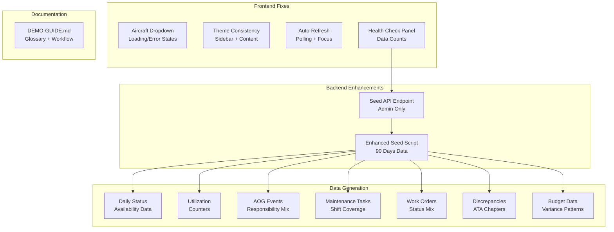

# Design Document: Demo Preparation

## Overview

This feature prepares the Alpha Star Aviation KPIs Dashboard for a stakeholder demo by addressing critical issues: fixing aircraft dropdown population, enhancing the seed script with comprehensive demo data, fixing theme consistency between sidebar and content, and creating a demo guide document. The goal is to ensure all charts display meaningful data and the UI looks polished and professional.

## Architecture



## Components and Interfaces

### Enhanced Seed Script

The existing `backend/src/scripts/seed.ts` will be enhanced to generate comprehensive demo data:

```typescript
interface SeedConfig {
  daysOfData: number;           // 90 days
  aircraftCount: number;        // From AIRCRAFT_DATA array
  aogEventsPerAircraft: number; // 2-5 events
  maintenanceTasksPerDay: number; // 3-8 tasks
  workOrdersPerAircraft: number;  // 5-10 orders
  discrepanciesPerAircraft: number; // 3-8 discrepancies
}

interface DailyStatusSeed {
  aircraftId: ObjectId;
  date: Date;
  posHours: number;      // Always 24
  fmcHours: number;      // 18-24 (realistic availability)
  nmcmSHours: number;    // 0-4 (scheduled downtime)
  nmcmUHours: number;    // 0-2 (unscheduled downtime)
}

interface UtilizationSeed {
  aircraftId: ObjectId;
  date: Date;
  airframeHoursTtsn: number;    // Monotonically increasing
  airframeCyclesTcsn: number;   // Monotonically increasing
  // Engine counters follow same pattern
}
```

### Aircraft Dropdown Component

Enhanced dropdown with proper loading, error, and empty states:

```typescript
interface AircraftDropdownProps {
  value?: string;
  onChange: (aircraftId: string) => void;
  placeholder?: string;
  includeAll?: boolean;
}

interface AircraftDropdownState {
  isLoading: boolean;
  error: Error | null;
  aircraft: Aircraft[];
}
```

### Health Check Panel

New component for verifying demo data:

```typescript
interface HealthCheckData {
  collections: {
    name: string;
    count: number;
    status: 'ok' | 'warning' | 'empty';
  }[];
  lastFetch: Date;
  apiStatus: 'connected' | 'error';
}
```

### Theme Consistency

The sidebar currently uses dark theme tokens regardless of mode. The fix involves:
1. Creating theme-aware sidebar variants
2. Updating CSS variables for sidebar in both light and dark modes
3. Ensuring smooth transitions when theme changes

## Data Models

### Seed Data Generation Rules

| Collection | Records per Aircraft | Total (17 aircraft) | Key Variations |
|------------|---------------------|---------------------|----------------|
| Daily Status | 90 days | ~1,530 | FMC: 18-24h, occasional downtime |
| Utilization | 90 days | ~1,530 | Monotonic, 2-8 FH/day |
| AOG Events | 3-5 | ~60 | All 5 responsible parties |
| Maintenance Tasks | 5-10/day | ~600 | All 3 shifts, varied costs |
| Work Orders | 5-10 | ~120 | All 4 statuses, some overdue |
| Discrepancies | 3-8 | ~90 | 16 ATA chapters |
| Actual Spend | 12 months | ~864 | Variance patterns |

### Responsible Party Distribution

```typescript
const RESPONSIBLE_PARTY_WEIGHTS = {
  'Internal': 0.40,    // 40% of AOG events
  'OEM': 0.25,         // 25%
  'Customs': 0.15,     // 15%
  'Finance': 0.10,     // 10%
  'Other': 0.10,       // 10%
};
```

### ATA Chapter Distribution

```typescript
const ATA_CHAPTERS = [
  '21', // Air Conditioning
  '24', // Electrical Power
  '27', // Flight Controls
  '29', // Hydraulic Power
  '32', // Landing Gear
  '34', // Navigation
  '36', // Pneumatic
  '49', // APU
  '52', // Doors
  '71', // Power Plant
  '72', // Engine
  '73', // Engine Fuel
  '74', // Ignition
  '78', // Exhaust
  '79', // Oil
  '80', // Starting
];
```

## Correctness Properties

*A property is a characteristic or behavior that should hold true across all valid executions of a system-essentially, a formal statement about what the system should do. Properties serve as the bridge between human-readable specifications and machine-verifiable correctness guarantees.*

Based on the prework analysis, the following correctness properties have been identified:

### Property 1: Aircraft Dropdown Population
*For any* page with an aircraft filter, when the page loads and the API returns aircraft data, the dropdown should contain exactly the same number of options as active aircraft in the response.
**Validates: Requirements 1.1**

### Property 2: Seed Data Monotonic Counters
*For any* aircraft and any two consecutive days in the seeded utilization data, the later day's counter values (airframeHoursTtsn, airframeCyclesTcsn) should be greater than or equal to the earlier day's values.
**Validates: Requirements 2.3**

### Property 3: Seed Data Responsible Party Coverage
*For any* set of seeded AOG events, all five responsible parties (Internal, OEM, Customs, Finance, Other) should be represented at least once.
**Validates: Requirements 2.4**

### Property 4: Seed Data Shift Coverage
*For any* set of seeded maintenance tasks, all three shifts (Morning, Evening, Night) should be represented.
**Validates: Requirements 2.5**

### Property 5: Seed Data Work Order Status Mix
*For any* set of seeded work orders, all four statuses (Open, InProgress, Closed, Deferred) should be represented, and at least one work order should be overdue.
**Validates: Requirements 2.6**

### Property 6: Seed Data ATA Chapter Coverage
*For any* set of seeded discrepancies, at least 10 different ATA chapters should be represented.
**Validates: Requirements 2.7**

### Property 7: Health Check Collection Counts
*For any* health check panel render, the displayed count for each collection should match the actual count in the database.
**Validates: Requirements 4.1**

### Property 8: Health Check Empty Warning
*For any* collection with zero records, the health check panel should display that collection with a warning/empty status indicator.
**Validates: Requirements 4.3**

### Property 9: Theme Consistency
*For any* theme selection (light or dark), both the sidebar and main content area should have the same theme applied (both light or both dark).
**Validates: Requirements 6.1, 6.2**

### Property 10: RBAC Viewer Restriction
*For any* user with Viewer role attempting a write operation (create, update, delete), the operation should be rejected with an authorization error.
**Validates: Requirements 7.3**

### Property 11: RBAC Editor Permission
*For any* user with Editor role attempting a write operation on operational data, the operation should succeed.
**Validates: Requirements 7.4**

### Property 12: Dashboard KPIs Non-Zero After Seed
*For any* dashboard load after running the seed script, all four KPI values (fleet availability, total flight hours, total cycles, active AOG count) should be non-zero.
**Validates: Requirements 8.1**

### Property 13: Query Invalidation After Mutation
*For any* successful mutation (create/update), the related queries should be invalidated and refetched, resulting in fresh data being displayed.
**Validates: Requirements 5.3**

## Error Handling

### Aircraft Dropdown Errors
- API failure: Display error message with retry button
- Empty response: Display guidance message to add aircraft or run seed
- Loading state: Show spinner/skeleton in dropdown

### Seed Script Errors
- Database connection failure: Log error and exit with code 1
- Duplicate key errors: Skip existing records, log warning
- Validation errors: Log specific error, continue with other records

### Theme Errors
- Invalid theme value: Default to light mode
- localStorage unavailable: Use system preference

## Testing Strategy

### Dual Testing Approach

**Unit Tests** verify specific behaviors:
- Aircraft dropdown renders loading state
- Aircraft dropdown renders error state with retry
- Health check displays correct counts
- Theme toggle updates both sidebar and content

**Property-Based Tests** verify universal properties:
- Use **fast-check** library for TypeScript property-based testing
- Each property test runs minimum 100 iterations
- Tests are tagged with property references: `**Feature: demo-preparation, Property N: description**`

### Test Categories

| Category | Framework | Focus |
|----------|-----------|-------|
| Unit Tests | Vitest + React Testing Library | Component states, interactions |
| Property Tests | fast-check | Seed data invariants, RBAC |
| Integration Tests | Vitest | API wiring, query invalidation |

### Property Test Implementation

```typescript
// Example: Property 2 - Seed Data Monotonic Counters
describe('Seed Script', () => {
  it('**Feature: demo-preparation, Property 2: Seed Data Monotonic Counters**', () => {
    fc.assert(
      fc.property(
        fc.array(fc.record({
          date: fc.date(),
          airframeHoursTtsn: fc.float({ min: 0, max: 100000 }),
        }), { minLength: 2 }),
        (counters) => {
          const sorted = counters.sort((a, b) => a.date.getTime() - b.date.getTime());
          for (let i = 1; i < sorted.length; i++) {
            expect(sorted[i].airframeHoursTtsn).toBeGreaterThanOrEqual(sorted[i-1].airframeHoursTtsn);
          }
        }
      ),
      { numRuns: 100 }
    );
  });
});
```

