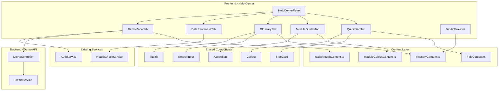

# Design Document: Help Center (Docs • Guided Tour • Glossary • Demo Mode)

## Overview

This feature adds a comprehensive in-app Help Center to the Alpha Star Aviation KPIs Dashboard. The Help Center provides self-service documentation, aviation terminology glossary, data readiness diagnostics, and demo data management. It integrates seamlessly with the existing sidebar navigation and supports both dark and light themes. The implementation follows a content-driven architecture where documentation is stored in typed TypeScript files, enabling easy maintenance without component modifications.

## Architecture



## Components and Interfaces

### New Frontend Components

| Component | Location | Purpose |
|-----------|----------|---------|
| `HelpCenterPage` | `pages/HelpCenterPage.tsx` | Main page with tabbed interface |
| `QuickStartTab` | `components/help/QuickStartTab.tsx` | Onboarding flow display |
| `ModuleGuidesTab` | `components/help/ModuleGuidesTab.tsx` | Accordion-based module documentation |
| `GlossaryTab` | `components/help/GlossaryTab.tsx` | Searchable glossary with categories |
| `DataReadinessTab` | `components/help/DataReadinessTab.tsx` | Data diagnostic checklist |
| `DemoModeTab` | `components/help/DemoModeTab.tsx` | Seed/reset controls and walkthrough |
| `StepCard` | `components/help/StepCard.tsx` | Numbered step display for Quick Start |
| `Callout` | `components/help/Callout.tsx` | Info/warning/success callout boxes |
| `GlossaryTooltip` | `components/ui/GlossaryTooltip.tsx` | Reusable acronym tooltip wrapper |
| `SearchInput` | `components/ui/SearchInput.tsx` | Debounced search input |

### New Backend Endpoints

| Endpoint | Method | Auth | Description |
|----------|--------|------|-------------|
| `/api/demo/seed` | POST | Admin | Generate demo data with isDemo flag |
| `/api/demo/reset` | POST | Admin | Delete all records with isDemo: true |
| `/api/demo/status` | GET | Admin | Get demo data counts per collection |

### Content Files

| File | Location | Purpose |
|------|----------|---------|
| `helpContent.ts` | `lib/help/helpContent.ts` | Quick Start steps and callouts |
| `glossaryContent.ts` | `lib/help/glossaryContent.ts` | All glossary entries with categories |
| `moduleGuidesContent.ts` | `lib/help/moduleGuidesContent.ts` | Module documentation |
| `walkthroughContent.ts` | `lib/help/walkthroughContent.ts` | Demo walkthrough script |

### Sidebar Update

Add Help Center to `navigationGroups` in `Sidebar.tsx`:

```typescript
{
  label: 'Support',
  items: [
    { path: '/help', label: 'Help Center', icon: HelpCircle },
  ],
}
```

## Data Models

### Quick Start Step

```typescript
interface QuickStartStep {
  id: string;
  stepNumber: number;
  title: string;
  description: string;
  expectedOutcome: string;
  icon?: LucideIcon;
  screenshot?: string;
  navigationLink?: string;
  navigationLabel?: string;
}

interface QuickStartCallout {
  id: string;
  type: 'info' | 'warning' | 'success' | 'error';
  title: string;
  description: string;
  actionLink?: string;
  actionLabel?: string;
}
```

### Module Guide

```typescript
interface ModuleGuide {
  id: string;
  moduleName: string;
  icon: LucideIcon;
  purpose: string;
  requiredData: {
    collections: string[];
    endpoints: string[];
  };
  stepByStepUsage: string[];
  expectedOutputs: string[];
  emptyStateCauses: string[];
  kpiDefinitions: {
    term: string;
    definition: string;
    glossaryId?: string;
  }[];
  exportNotes?: string;
}
```

### Glossary Entry

```typescript
type GlossaryCategory = 'Operations' | 'Maintenance' | 'Finance' | 'General';

interface GlossaryEntry {
  id: string;
  term: string;
  acronym?: string;
  definition: string;
  whereItAppears: string[];
  howCalculated?: string;
  whyItMatters: string;
  exampleValue?: string;
  category: GlossaryCategory;
  relatedTerms?: string[];
}
```

### Data Readiness Item

```typescript
interface DataReadinessItem {
  id: string;
  pageName: string;
  pageRoute: string;
  requiredCollections: {
    name: string;
    description: string;
  }[];
  requiredEndpoints: string[];
  fixInstructions: {
    method: 'ui' | 'import' | 'seed' | 'api';
    description: string;
    link?: string;
    linkLabel?: string;
  }[];
}

interface DataReadinessStatus {
  collectionName: string;
  count: number;
  status: 'ok' | 'warning' | 'empty';
}
```

### Walkthrough Step

```typescript
interface WalkthroughStep {
  id: string;
  stepNumber: number;
  pageToVisit: string;
  pageRoute: string;
  featuresToHighlight: string[];
  talkingPoints: string[];
  expectedVisualOutput: string;
  estimatedMinutes: number;
}
```

### Demo API Response

```typescript
interface DemoSeedResponse {
  success: boolean;
  message: string;
  counts: {
    aircraft: number;
    dailyStatus: number;
    dailyCounters: number;
    aogEvents: number;
    maintenanceTasks: number;
    workOrders: number;
    discrepancies: number;
    budgetPlans: number;
    actualSpend: number;
  };
  duration: number; // milliseconds
}

interface DemoResetResponse {
  success: boolean;
  message: string;
  deletedCounts: {
    aircraft: number;
    dailyStatus: number;
    dailyCounters: number;
    aogEvents: number;
    maintenanceTasks: number;
    workOrders: number;
    discrepancies: number;
    budgetPlans: number;
    actualSpend: number;
  };
}

interface DemoStatusResponse {
  hasDemoData: boolean;
  counts: {
    aircraft: number;
    dailyStatus: number;
    dailyCounters: number;
    aogEvents: number;
    maintenanceTasks: number;
    workOrders: number;
    discrepancies: number;
    budgetPlans: number;
    actualSpend: number;
  };
}
```

### Schema Updates (isDemo field)

Add to all relevant schemas:

```typescript
@Prop({ type: Boolean, default: undefined })
isDemo?: boolean;
```

Affected schemas:
- `aircraft.schema.ts`
- `daily-status.schema.ts`
- `daily-counter.schema.ts`
- `aog-event.schema.ts`
- `maintenance-task.schema.ts`
- `work-order.schema.ts`
- `discrepancy.schema.ts`
- `budget-plan.schema.ts`
- `actual-spend.schema.ts`

## Correctness Properties

*A property is a characteristic or behavior that should hold true across all valid executions of a system-essentially, a formal statement about what the system should do. Properties serve as the bridge between human-readable specifications and machine-verifiable correctness guarantees.*

### Property 1: Quick Start Step Completeness
*For any* Quick Start step in the content, the step SHALL have a non-empty stepNumber, title, description, and expectedOutcome.
**Validates: Requirements 2.2**

### Property 2: Module Guide Section Completeness
*For any* module guide in the content, the guide SHALL have non-empty purpose, requiredData (with at least one collection or endpoint), stepByStepUsage (at least one step), expectedOutputs (at least one output), and emptyStateCauses (at least one cause).
**Validates: Requirements 3.2, 3.5**

### Property 3: Glossary Entry Completeness
*For any* glossary entry in the content, the entry SHALL have a non-empty term, definition, whereItAppears (at least one location), whyItMatters, and a valid category from the allowed set.
**Validates: Requirements 4.3**

### Property 4: Glossary Minimum Count
*For any* glossary content, the total number of entries SHALL be at least 25.
**Validates: Requirements 4.4**

### Property 5: Glossary Search Filtering
*For any* search query string and glossary entries, the filtered results SHALL contain only entries where the term, acronym, or definition contains the query (case-insensitive).
**Validates: Requirements 4.2**

### Property 6: Glossary Category Assignment
*For any* glossary entry, the category SHALL be exactly one of: 'Operations', 'Maintenance', 'Finance', or 'General'.
**Validates: Requirements 4.5**

### Property 7: Tooltip Glossary Link
*For any* tooltip displayed for an acronym, the tooltip SHALL include a link that navigates to the glossary entry for that term.
**Validates: Requirements 5.2**

### Property 8: Data Readiness Empty State Warning
*For any* collection with count equal to zero, the Data Readiness display SHALL show a warning status indicator and at least one fix instruction.
**Validates: Requirements 6.3, 6.4**

### Property 9: Demo Data Tagging
*For any* record created by the demo seed operation, the record SHALL have isDemo field set to true.
**Validates: Requirements 7.3, 11.3, 12.1**

### Property 10: Demo Reset Selectivity
*For any* demo reset operation, only records with isDemo: true SHALL be deleted, and records without isDemo or with isDemo: false SHALL remain unchanged.
**Validates: Requirements 7.6, 11.4, 12.2**

### Property 11: Production Data Integrity
*For any* demo seed operation, existing records without isDemo field SHALL not be modified or deleted.
**Validates: Requirements 12.4**

### Property 12: Walkthrough Step Completeness
*For any* walkthrough step in the content, the step SHALL have a non-empty pageToVisit, pageRoute, at least one featureToHighlight, at least one talkingPoint, expectedVisualOutput, and estimatedMinutes > 0.
**Validates: Requirements 8.2, 8.5**

### Property 13: Demo API Response Structure
*For any* successful demo seed or reset operation, the response SHALL include success: true, a non-empty message, and counts object with numeric values for all collections.
**Validates: Requirements 11.5**

### Property 14: Content-Driven UI Rendering
*For any* Help Center tab, the rendered UI elements SHALL correspond one-to-one with entries in the content data structures (no hardcoded content in components).
**Validates: Requirements 9.4**

## Error Handling

### API Errors
- Demo seed/reset endpoints return 403 for non-Admin users
- Demo operations return 500 with error message if database operation fails
- Health check endpoint returns cached data if database is temporarily unavailable

### Content Errors
- Missing glossary entry for tooltip falls back to inline definition
- Invalid navigation links show disabled state with tooltip explaining the issue
- Empty content arrays render helpful "No content available" message

### UI Errors
- Tab switching errors caught by ErrorBoundary with retry option
- Search input debounced to prevent excessive filtering
- Demo operations show loading state and disable buttons during execution

## Testing Strategy

### Unit Tests
- Content validation: verify all entries have required fields
- Glossary search: test filtering logic with various queries
- Data readiness status calculation: test status determination logic
- Demo response parsing: test response structure validation

### Property-Based Tests (using fast-check)
- Quick Start step completeness across all steps
- Module guide section completeness across all guides
- Glossary entry completeness across all entries
- Glossary search filtering correctness
- Demo data tagging verification
- Demo reset selectivity verification

### Integration Tests
- Demo seed endpoint creates records with isDemo: true
- Demo reset endpoint deletes only demo records
- Health check endpoint returns accurate counts
- Help Center page renders all tabs correctly

### E2E Tests
- Navigate to Help Center from sidebar
- Switch between all tabs
- Search glossary and verify filtering
- Admin can seed and reset demo data
- Non-admin sees restricted access message

## UI Component Specifications

### HelpCenterPage Layout
- Full-width page with max-width container (1200px)
- Tab bar at top with 5 tabs, icons + labels
- Active tab indicator with accent color
- Content area with consistent padding (24px)

### QuickStartTab
- Vertical timeline layout with step cards
- Step cards: number badge, title, description, outcome box
- Callout boxes between steps for warnings/tips
- Navigation links styled as buttons

### ModuleGuidesTab
- Accordion with module icon + name as header
- Expanded content with section headings
- Code-style formatting for endpoints/collections
- Linked terms open glossary in modal or navigate

### GlossaryTab
- Sticky search bar at top
- Category filter pills below search
- Card grid layout for entries (2-3 columns)
- Entry cards: term (bold), definition, category badge
- Expandable details for calculation/example

### DataReadinessTab
- Table layout with columns: Page, Collections, Status, Actions
- Status badges: green (OK), amber (Warning), red (Empty)
- Action buttons link to relevant pages
- Refresh button to re-fetch counts

### DemoModeTab
- Two-column layout: Controls (left), Walkthrough (right)
- Seed/Reset buttons with confirmation dialogs
- Progress indicator during operations
- Walkthrough as numbered list with expandable details

### Color Scheme (Theme-Aware)
| Element | Light Mode | Dark Mode |
|---------|-----------|-----------|
| Tab Active | blue-600 | blue-400 |
| Callout Info | blue-50/blue-700 | blue-900/blue-300 |
| Callout Warning | amber-50/amber-700 | amber-900/amber-300 |
| Callout Success | green-50/green-700 | green-900/green-300 |
| Status OK | green-500 | green-400 |
| Status Warning | amber-500 | amber-400 |
| Status Empty | red-500 | red-400 |

