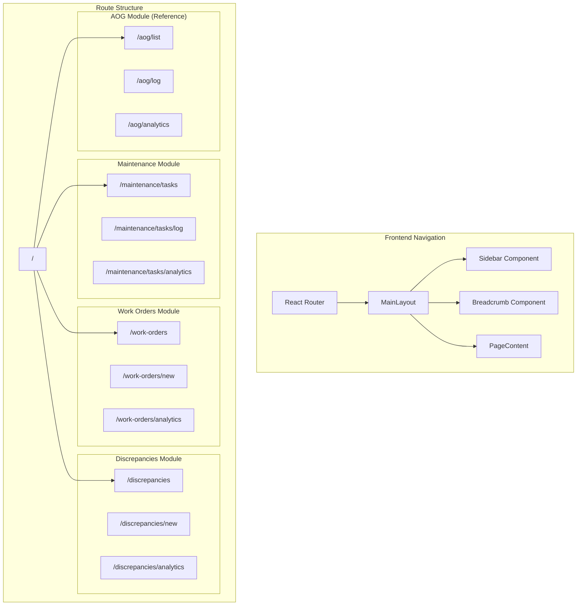

# Design Document: Navigation UI Revamp & FE/BE Sync

## Overview

This design document outlines the comprehensive refactoring of the Alpha Star Aviation KPI Dashboard navigation system. The primary goals are:

1. Convert tab-based navigation in Maintenance Tasks, Work Orders, and Discrepancies modules to nested routes with sidebar sublists
2. Ensure Daily Status bulk import has full parity with other import types
3. Synchronize frontend routes, types, and API calls with backend endpoints and DTOs
4. Enable deep-linking from dashboard alerts to specific sub-routes
5. Maintain backward compatibility for existing URLs

The AOG Events module already follows the correct pattern and serves as the reference implementation.

## Architecture



## Components and Interfaces

### Route Configuration

The new route structure follows the AOG Events pattern:

| Module | Route | Component | Description |
|--------|-------|-----------|-------------|
| Maintenance Tasks | `/maintenance/tasks` | MaintenanceTasksListPage | Task list view |
| Maintenance Tasks | `/maintenance/tasks/log` | MaintenanceTasksLogPage | Log new task form |
| Maintenance Tasks | `/maintenance/tasks/analytics` | MaintenanceTasksAnalyticsPage | Summary and charts |
| Work Orders | `/work-orders` | WorkOrdersListPage | Work orders list |
| Work Orders | `/work-orders/new` | WorkOrdersNewPage | Create work order form |
| Work Orders | `/work-orders/analytics` | WorkOrdersAnalyticsPage | Analytics and charts |
| Discrepancies | `/discrepancies` | DiscrepanciesListPage | Discrepancies list |
| Discrepancies | `/discrepancies/new` | DiscrepanciesNewPage | Log discrepancy form |
| Discrepancies | `/discrepancies/analytics` | DiscrepanciesAnalyticsPage | ATA chapter analytics |

### Sidebar Navigation Configuration

```typescript
interface NavSubItemConfig {
  path: string;
  label: string;
  icon: LucideIcon;
  editorOnly?: boolean;
}

interface NavItemConfig {
  path: string;
  label: string;
  icon: LucideIcon;
  adminOnly?: boolean;
  editorOnly?: boolean;
  subItems?: NavSubItemConfig[];
}

// Updated navigation configuration
const navigationGroups: NavGroupConfig[] = [
  {
    label: 'Operations',
    items: [
      { path: '/', label: 'Dashboard', icon: LayoutDashboard },
      { path: '/availability', label: 'Fleet Availability', icon: Plane },
      { path: '/daily-status', label: 'Daily Status', icon: Calendar },
    ],
  },
  {
    label: 'Maintenance',
    items: [
      { 
        path: '/maintenance/tasks', 
        label: 'Maintenance Tasks', 
        icon: Wrench,
        subItems: [
          { path: '/maintenance/tasks', label: 'Task List', icon: List },
          { path: '/maintenance/tasks/log', label: 'Log Task', icon: PlusCircle, editorOnly: true },
          { path: '/maintenance/tasks/analytics', label: 'Analytics', icon: BarChart3 },
        ],
      },
      { 
        path: '/aog', 
        label: 'AOG & Events', 
        icon: AlertTriangle,
        subItems: [
          { path: '/aog/list', label: 'Events List', icon: List },
          { path: '/aog/log', label: 'Log Event', icon: PlusCircle, editorOnly: true },
          { path: '/aog/analytics', label: 'Analytics', icon: BarChart3 },
        ],
      },
      { 
        path: '/work-orders', 
        label: 'Work Orders', 
        icon: ClipboardList,
        subItems: [
          { path: '/work-orders', label: 'Work Orders', icon: List },
          { path: '/work-orders/new', label: 'New WO', icon: PlusCircle, editorOnly: true },
          { path: '/work-orders/analytics', label: 'Analytics', icon: BarChart3 },
        ],
      },
      { 
        path: '/discrepancies', 
        label: 'Discrepancies', 
        icon: Search,
        subItems: [
          { path: '/discrepancies', label: 'Discrepancies', icon: List },
          { path: '/discrepancies/new', label: 'New', icon: PlusCircle, editorOnly: true },
          { path: '/discrepancies/analytics', label: 'Analytics', icon: BarChart3 },
        ],
      },
    ],
  },
  // ... rest of navigation
];
```

### Alert Deep-Link Configuration

```typescript
interface AlertAction {
  type: 'aog' | 'work-order' | 'discrepancy' | 'maintenance' | 'budget';
  route: string;
  params?: Record<string, string>;
}

// Alert routing map
const ALERT_ROUTES: Record<string, AlertAction> = {
  'active-aog': { type: 'aog', route: '/aog/list', params: { status: 'active' } },
  'overdue-wo': { type: 'work-order', route: '/work-orders', params: { overdue: 'true' } },
  'open-discrepancy': { type: 'discrepancy', route: '/discrepancies', params: { uncorrected: 'true' } },
  'maintenance-due': { type: 'maintenance', route: '/maintenance/tasks', params: {} },
  'budget-warning': { type: 'budget', route: '/budget', params: {} },
};
```

### Breadcrumb Component

```typescript
interface BreadcrumbItem {
  label: string;
  path?: string;
}

interface BreadcrumbProps {
  items: BreadcrumbItem[];
}

// Route to breadcrumb mapping
const ROUTE_BREADCRUMBS: Record<string, BreadcrumbItem[]> = {
  '/maintenance/tasks': [
    { label: 'Maintenance', path: '/maintenance/tasks' },
    { label: 'Tasks' },
  ],
  '/maintenance/tasks/log': [
    { label: 'Maintenance', path: '/maintenance/tasks' },
    { label: 'Tasks', path: '/maintenance/tasks' },
    { label: 'Log Task' },
  ],
  '/maintenance/tasks/analytics': [
    { label: 'Maintenance', path: '/maintenance/tasks' },
    { label: 'Tasks', path: '/maintenance/tasks' },
    { label: 'Analytics' },
  ],
  // ... similar for other routes
};
```

## Data Models

### Daily Status Import Validation

The Daily Status import uses the same validation pipeline as other import types:

```typescript
interface DailyStatusImportRow {
  aircraftRegistration: string;  // Required, must exist in aircraft collection
  date: Date;                    // Required, YYYY-MM-DD format
  posHours: number;              // Required, 0-24 range
  nmcmSHours: number;            // Required, 0-24 range
  nmcmUHours: number;            // Required, 0-24 range
  nmcsHours?: number;            // Optional, 0-24 range
  notes?: string;                // Optional
}

// Validation rules
const DAILY_STATUS_VALIDATION = {
  hourRange: { min: 0, max: 24 },
  downtimeSumRule: (pos: number, nmcmS: number, nmcmU: number, nmcs: number) => 
    (nmcmS + nmcmU + nmcs) <= pos,
  uniqueKey: ['aircraftId', 'date'],
  duplicateStrategy: 'reject', // Options: 'reject', 'upsert', 'skip'
};

// FMC calculation
const calculateFMC = (pos: number, nmcmS: number, nmcmU: number, nmcs: number): number => {
  return Math.max(0, Math.min(pos, pos - nmcmS - nmcmU - nmcs));
};
```

### FE/BE Type Synchronization

Ensure these types match between frontend and backend:

```typescript
// Import Types (must match backend ImportType enum)
enum ImportType {
  Utilization = 'utilization',
  MaintenanceTasks = 'maintenance_tasks',
  AOGEvents = 'aog_events',
  Budget = 'budget',
  Aircraft = 'aircraft',
  DailyStatus = 'daily_status',
}

// Export Types (must match backend ExportType)
type ExportType = 
  | 'aircraft'
  | 'utilization'
  | 'daily-status'
  | 'aog-events'
  | 'maintenance'
  | 'work-orders'
  | 'discrepancies'
  | 'budget';

// Route naming convention: kebab-case
// API endpoint convention: kebab-case with /api prefix
```

## Correctness Properties

*A property is a characteristic or behavior that should hold true across all valid executions of a system-essentially, a formal statement about what the system should do. Properties serve as the bridge between human-readable specifications and machine-verifiable correctness guarantees.*

Based on the prework analysis, the following correctness properties have been identified:

### Property 1: Daily Status Hour Range Validation
*For any* Daily Status import row, if any hour field (posHours, nmcmSHours, nmcmUHours, nmcsHours) is outside the range [0, 24], the validation should fail with a specific error message identifying the invalid field.
**Validates: Requirements 4.2, 4.3**

### Property 2: Daily Status Downtime Sum Validation
*For any* Daily Status import row, if the sum of downtime hours (nmcmSHours + nmcmUHours + nmcsHours) exceeds posHours, the validation should fail with an error message indicating the sum exceeds possessed hours.
**Validates: Requirements 4.2, 4.3**

### Property 3: Daily Status FMC Calculation
*For any* valid Daily Status record with posHours, nmcmSHours, nmcmUHours, and nmcsHours, the calculated fmcHours should equal (posHours - nmcmSHours - nmcmUHours - nmcsHours), clamped to the range [0, posHours].
**Validates: Requirements 4.4**

### Property 4: Daily Status Duplicate Detection
*For any* Daily Status import where a record already exists for the same aircraft and date combination, the import should reject the duplicate row and report it as an error.
**Validates: Requirements 4.5**

## Error Handling

### Navigation Errors
- Invalid routes redirect to the nearest valid parent route
- Missing required URL parameters show appropriate error messages
- Role-based access violations redirect to the list view with a toast notification

### Import Errors
- Row-level validation errors are collected and displayed in the preview
- Aircraft not found errors include the registration in the message
- Hour range violations specify which field and what the valid range is
- Duplicate detection errors include the existing record's date

### Alert Deep-Link Errors
- If the target entity no longer exists, show a "not found" message
- If the user lacks permission for the target view, redirect to the list view

## Testing Strategy

**Note:** Per user request, testing tasks are excluded from the implementation plan to enable faster delivery. The following testing strategy is documented for future reference but will not be implemented as part of this spec.

### Manual Testing Checklist
- Verify all nested routes render correct components
- Verify sidebar expands/collapses correctly
- Verify breadcrumbs display correct path
- Verify alert deep-links navigate to correct destinations
- Verify Daily Status import workflow end-to-end
- Verify backward compatibility redirects work

### Future Property-Based Tests (Not Implemented)
- Daily Status hour range validation
- Daily Status downtime sum validation
- Daily Status FMC calculation
- Daily Status duplicate detection

