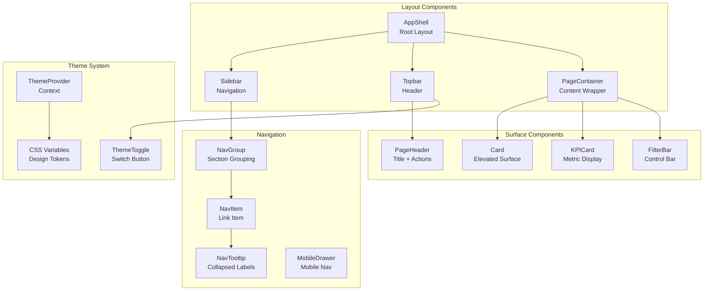

# Design Document: Premium UI Revamp

## Overview

This feature transforms the Alpha Star Aviation KPIs Dashboard from a basic shadcn/ui implementation into a premium, aviation-inspired enterprise interface. The revamp focuses exclusively on visual presentation, layout composition, and interaction polish without modifying any business logic, data fetching, or routing.

The design language draws inspiration from aircraft instrument panels: precision, clean lines, data-dense layouts, and calm confidence. The color palette uses navy/charcoal as the base with teal/sky-blue as the accent color, creating a professional aviation aesthetic.

## Architecture



## Components and Interfaces

### Component Hierarchy

| Component | Responsibility | Props |
|-----------|---------------|-------|
| `AppShell` | Root layout orchestrating sidebar, topbar, and content | `children` |
| `Sidebar` | Collapsible navigation with grouped items | `collapsed`, `onToggle` |
| `NavGroup` | Section grouping with label | `label`, `children` |
| `NavItem` | Individual navigation link | `to`, `icon`, `label`, `end?` |
| `Topbar` | Sticky header with context and actions | `title`, `breadcrumbs`, `actions` |
| `PageHeader` | Page title with optional actions | `title`, `subtitle?`, `actions?` |
| `UserMenu` | Avatar dropdown with user info and logout | - |
| `ThemeToggle` | Dark/light mode switch | - |
| `MobileDrawer` | Slide-out navigation for mobile | `open`, `onClose` |
| `Card` | Elevated surface container | `className`, `children` |
| `KPICard` | Metric display with icon and value | `icon`, `label`, `value`, `unit`, `trend?` |
| `FilterBar` | Unified filter controls container | `children` |
| `PageTransition` | Animated content wrapper | `children` |

### Sidebar Navigation Structure

```typescript
const navigationGroups = [
  {
    label: 'Operations',
    items: [
      { path: '/', label: 'Dashboard', icon: LayoutDashboard },
      { path: '/availability', label: 'Fleet Availability', icon: Plane },
    ],
  },
  {
    label: 'Maintenance',
    items: [
      { path: '/maintenance', label: 'Maintenance Tasks', icon: Wrench },
      { path: '/events', label: 'AOG & Events', icon: AlertTriangle },
      { path: '/work-orders', label: 'Work Orders', icon: ClipboardList },
      { path: '/discrepancies', label: 'Discrepancies', icon: Search },
    ],
  },
  {
    label: 'Finance',
    items: [
      { path: '/budget', label: 'Budget & Cost', icon: DollarSign },
    ],
  },
  {
    label: 'Administration',
    items: [
      { path: '/import', label: 'Data Import', icon: Upload },
      { path: '/admin', label: 'Settings', icon: Settings, adminOnly: true },
    ],
  },
];
```

## Data Models

### Theme Token Structure

```typescript
interface ThemeTokens {
  // Base colors
  background: string;
  foreground: string;
  
  // Surface colors
  card: string;
  cardForeground: string;
  popover: string;
  popoverForeground: string;
  
  // Brand colors
  primary: string;
  primaryForeground: string;
  
  // Semantic colors
  secondary: string;
  secondaryForeground: string;
  muted: string;
  mutedForeground: string;
  accent: string;
  accentForeground: string;
  destructive: string;
  destructiveForeground: string;
  
  // Aviation accent
  aviation: string;
  aviationForeground: string;
  aviationMuted: string;
  
  // Borders and inputs
  border: string;
  input: string;
  ring: string;
  
  // Sidebar specific
  sidebarBackground: string;
  sidebarForeground: string;
  sidebarBorder: string;
  sidebarAccent: string;
  sidebarAccentForeground: string;
  sidebarActiveGlow: string;
  
  // Radius
  radius: string;
}

interface SidebarState {
  collapsed: boolean;
  mobileOpen: boolean;
}

interface BreadcrumbItem {
  label: string;
  href?: string;
}
```

## Design Specifications

### Color Palette

#### Light Mode
| Token | Value | Usage |
|-------|-------|-------|
| `--background` | `210 20% 98%` | Page background |
| `--foreground` | `222 47% 11%` | Primary text |
| `--card` | `0 0% 100%` | Card surfaces |
| `--sidebar-background` | `222 47% 11%` | Sidebar background (dark) |
| `--sidebar-foreground` | `210 40% 98%` | Sidebar text |
| `--aviation` | `187 71% 42%` | Teal accent |
| `--aviation-muted` | `187 50% 90%` | Subtle teal |
| `--border` | `214 32% 91%` | Borders |
| `--muted` | `210 40% 96%` | Muted backgrounds |

#### Dark Mode
| Token | Value | Usage |
|-------|-------|-------|
| `--background` | `222 47% 6%` | Page background |
| `--foreground` | `210 40% 98%` | Primary text |
| `--card` | `222 47% 9%` | Card surfaces |
| `--sidebar-background` | `222 47% 4%` | Sidebar background |
| `--sidebar-foreground` | `210 40% 98%` | Sidebar text |
| `--aviation` | `187 71% 50%` | Teal accent (brighter) |
| `--aviation-muted` | `187 30% 20%` | Subtle teal |
| `--border` | `217 33% 17%` | Borders |
| `--muted` | `217 33% 12%` | Muted backgrounds |

### Typography Scale

| Level | Size | Weight | Line Height | Usage |
|-------|------|--------|-------------|-------|
| Display | 36px / 2.25rem | 700 | 1.1 | Dashboard KPI values |
| H1 | 30px / 1.875rem | 600 | 1.2 | Page titles |
| H2 | 24px / 1.5rem | 600 | 1.3 | Section headers |
| H3 | 20px / 1.25rem | 600 | 1.4 | Card titles |
| Body | 14px / 0.875rem | 400 | 1.5 | Default text |
| Small | 12px / 0.75rem | 400 | 1.4 | Labels, captions |
| Tiny | 11px / 0.6875rem | 500 | 1.3 | Badges, tags |

### Spacing Scale

| Token | Value | Usage |
|-------|-------|-------|
| `space-1` | 4px | Tight gaps |
| `space-2` | 8px | Small gaps |
| `space-3` | 12px | Medium gaps |
| `space-4` | 16px | Standard padding |
| `space-5` | 20px | Card padding |
| `space-6` | 24px | Section gaps |
| `space-8` | 32px | Large gaps |
| `space-10` | 40px | Page margins |

### Shadow Scale

| Level | Light Mode | Dark Mode |
|-------|------------|-----------|
| `shadow-sm` | `0 1px 2px rgba(0,0,0,0.05)` | `0 1px 2px rgba(0,0,0,0.3)` |
| `shadow` | `0 1px 3px rgba(0,0,0,0.1), 0 1px 2px rgba(0,0,0,0.06)` | `0 1px 3px rgba(0,0,0,0.4)` |
| `shadow-md` | `0 4px 6px rgba(0,0,0,0.1)` | `0 4px 6px rgba(0,0,0,0.4)` |
| `shadow-lg` | `0 10px 15px rgba(0,0,0,0.1)` | `0 10px 15px rgba(0,0,0,0.5)` |
| `shadow-glow` | `0 0 20px rgba(14,165,165,0.15)` | `0 0 20px rgba(14,165,165,0.25)` |

### Component Specifications

#### Sidebar
- Width expanded: 260px
- Width collapsed: 72px
- Transition: 200ms ease-out
- Active item: left border 3px, background highlight, subtle glow
- Section labels: uppercase, 11px, tracking-wider, muted color
- Item padding: 12px horizontal, 10px vertical
- Icon size: 20px
- Gap between icon and label: 12px

#### Topbar
- Height: 64px
- Position: sticky top-0
- Background: card with subtle border-bottom
- Padding: 0 24px
- Z-index: 40

#### Cards
- Border radius: 12px
- Padding: 20px
- Border: 1px solid border color
- Shadow: shadow-sm (light), shadow (dark)
- Background: card color

#### KPI Cards
- Min height: 120px
- Icon container: 40px, rounded-lg, aviation-muted background
- Value: display size, font-bold
- Label: small size, muted-foreground
- Trend indicator: small arrow with color coding

#### Filter Bar
- Background: muted/5
- Border: 1px solid border
- Border radius: 8px
- Padding: 12px 16px
- Gap between controls: 16px
- Control height: 36px

### Animation Specifications

| Animation | Duration | Easing | Property |
|-----------|----------|--------|----------|
| Sidebar collapse | 200ms | ease-out | width |
| Hover states | 150ms | ease | background, color |
| Page transition | 200ms | ease-out | opacity, transform |
| Theme transition | 300ms | ease | background, color |
| Active glow | 300ms | ease | box-shadow |

## Correctness Properties

*A property is a characteristic or behavior that should hold true across all valid executions of a system-essentially, a formal statement about what the system should do. Properties serve as the bridge between human-readable specifications and machine-verifiable correctness guarantees.*

Based on the prework analysis, the following correctness properties have been identified:

### Property 1: Topbar Title Matches Route
*For any* route in the application, the topbar title and breadcrumbs should correctly reflect the current page based on the route path.
**Validates: Requirements 2.1**

### Property 2: KPI Card Empty State Rendering
*For any* KPI card with a value of 0, null, or undefined, the component should render an empty state UI rather than displaying the raw zero value.
**Validates: Requirements 4.3**

### Property 3: Button State Consistency
*For any* button component, the visual styling should correctly reflect its current state (default, hover, active, disabled, loading) with appropriate CSS classes applied.
**Validates: Requirements 5.2**

### Property 4: Theme Token Usage
*For any* component in the UI, color values should reference CSS custom properties (theme tokens) rather than hardcoded hex values, ensuring consistent theming.
**Validates: Requirements 7.2**

## Error Handling

### Theme Errors
- If theme context is unavailable, default to light mode
- If localStorage theme preference is corrupted, reset to system preference

### Navigation Errors
- If route doesn't match any navigation item, no item should be highlighted as active
- If user lacks permission for admin routes, admin nav items should be hidden

### Responsive Errors
- If viewport detection fails, default to desktop layout
- Mobile drawer should close on route change to prevent stale state

## Testing Strategy

### Dual Testing Approach

The UI revamp uses both unit tests and property-based tests:

**Unit Tests** verify specific UI behaviors:
- Component rendering with various props
- Theme toggle functionality
- Sidebar collapse/expand behavior
- Responsive breakpoint handling

**Property-Based Tests** verify universal UI properties:
- Use **fast-check** library for TypeScript property-based testing
- Each property test runs minimum 100 iterations
- Tests are tagged with property references: `**Feature: premium-ui-revamp, Property N: description**`

### Test Categories

| Category | Framework | Focus |
|----------|-----------|-------|
| Unit Tests | Vitest + React Testing Library | Component rendering, interactions |
| Property Tests | fast-check | Universal UI properties |
| Visual Tests | Storybook (optional) | Component appearance |
| A11y Tests | axe-core | Accessibility compliance |

### Property Test Implementation

```typescript
// Example: Property 1 - Topbar Title Matches Route
describe('Topbar', () => {
  it('**Feature: premium-ui-revamp, Property 1: Topbar Title Matches Route**', () => {
    const routes = [
      { path: '/', title: 'Dashboard' },
      { path: '/availability', title: 'Fleet Availability' },
      { path: '/maintenance', title: 'Maintenance Tasks' },
      // ... all routes
    ];
    
    fc.assert(
      fc.property(
        fc.constantFrom(...routes),
        (route) => {
          // Navigate to route and verify topbar title matches
          render(<MemoryRouter initialEntries={[route.path]}><AppShell /></MemoryRouter>);
          expect(screen.getByRole('heading')).toHaveTextContent(route.title);
        }
      ),
      { numRuns: 100 }
    );
  });
});
```

### Test File Organization

```
frontend/
├── src/
│   ├── components/
│   │   ├── layout/
│   │   │   ├── AppShell.tsx
│   │   │   ├── AppShell.test.tsx
│   │   │   ├── Sidebar.tsx
│   │   │   ├── Sidebar.test.tsx
│   │   │   ├── Topbar.tsx
│   │   │   └── Topbar.test.tsx
│   │   └── ui/
│   │       ├── KPICard.tsx
│   │       ├── KPICard.test.tsx
│   │       └── KPICard.property.test.tsx
```
